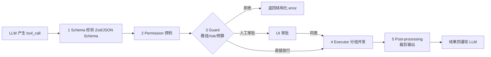
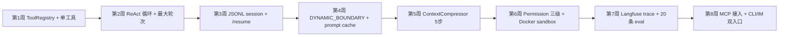

# 02 · Agent 使用与构建的最佳实践

> 目标读者：既用现成 Agent（Claude Code / Cursor），也自己在写 Agent 的开发者。本章总结的都是从 Claude Code 泄漏源码、Anthropic 博客、OpenAI Harness Engineering、Hermes 源码里交叉验证过的做法。

## 2.1 心法：三句话记牢

1. **上下文是你能写出的最值钱代码**。模型能力很快会变，你写的规约、工具描述、skill 才留下来。[1]
2. **Agent 的默认行为应该是能被你信任的最弱版本**。弱默认 + 显式授权 > 强默认 + 事后审计。（OpenClaw 血淋淋的反例见 05）
3. **每 N 轮做一次"我在干嘛"的显式记录**。TODO / NEXT / 压缩断点，防止长会话失忆。[2]

## 2.2 System Prompt 设计的 6 条硬规矩

| 规则 | Claude Code 对应证据 |
| --- | --- |
| 静态/动态分离：固定内容放前面走缓存，变动内容放后面 | `DYNAMIC_BOUNDARY` 把 system prompt 切成 5 段静态 + 5 段动态 [2] |
| 缓存边界不要乱动：工具顺序、段落顺序都要稳定 | Claude Code 工具注册"stable ordering"是为了 prompt cache 命中 [2] |
| 限制单项配置的字符数 | CLAUDE.md 单文件 ≤ 4000 字符，总预算 ≤ 12000 字符 [2] |
| 危险能力用 opt-in 段落，不写进默认 system prompt | Claude Code 的 "KAIROS 守护模式" 和插件都要走信任门 |
| 注入防御：本地配置文件也当作不可信输入扫描 | Hermes `_CONTEXT_THREAT_PATTERNS` 正则扫 `AGENTS.md`/`SOUL.md` [3] |
| System prompt 要能被热替换，但不要每轮重拼 | Hermes `self._cached_system_prompt` 只构造一次 [3] |

一张对照表总结坏做法 vs 好做法：

| 反模式 | 正模式 |
| --- | --- |
| 每轮重新拼 system prompt | 构造一次 + 明确的失效条件 |
| 把所有上下文一锅煮进 system | 分层：identity / 规则 / CLAUDE.md / ephemeral |
| CLAUDE.md 塞 200 行叮嘱 | ≤ 80 行核心规则；长文档单开 skill/context |
| 把密钥写进 tool description | 只写占位符，真正值通过运行时 secret 注入 |
| 动态凭证让 Agent 自己读 `config.json` | Gateway Tool 模式：Agent 只看到脱敏名字 [4] |

## 2.3 工具治理 —— 统一协议 > 功能堆砌

从 Hermes 源码和 Claude Code 的 ToolOrchestration 共同得出的模式：

关键要点：

- **校验前置**：不合法的参数不要进入 Executor，连 stderr 都不要让模型看到（减少幻觉）。
- **读/写分组并发**：读可并发、写必须串行，Claude Code `StreamingToolExecutor` 的原则 [2]。
- **失败要结构化**：返回 `{code, message, hint, retryable}`，模型能自修复；纯字符串 stacktrace 会让模型"瞎猜"。
- **Post-processing 裁剪**：tool_result 进入下一轮前先按预算截断，Claude Code 第 1 层压缩就在这里 [2]。

### 工具描述的 3 大禁忌

- 写进 description 里的"禁止命令清单"：会被 prompt injection 利用当提示。应在权限系统里做。
- 写 "this tool may fail, retry 3 times"：模型真的就会调 3 次，把 budget 烧完。
- 交叉引用别的工具：Hermes 专门在 `get_tool_definitions` 里动态剥 cross-reference，避免诱导幻觉 [3]。

## 2.4 风险动作两个概念 —— Blast Radius / Reversibility

这是 Anthropic 在 《Building Effective Agents》里强调过的决策维度 [1]：

| 维度 | 含义 | 例子：安全 | 例子：危险 |
| --- | --- | --- | --- |
| **Blast radius** | 出错时影响范围 | 本 repo 的一个文件 | `rm -rf ~` / 向 prod 数据库写 |
| **Reversibility** | 是否可回滚 | Git commit（可 revert） | 发送邮件 / 扣钱 / 发微博 |

> **实操规则**：小 blast + 高可逆 → 自动执行；大 blast 或低可逆 → 必须人工审批；大 blast 且低可逆 → 默认禁用，需要显式 flag 才打开。

Claude Code 把这套规则物化成三级权限 `ReadOnly / WorkspaceWrite / DangerFullAccess`，同时实现了 denial 追踪（记住用户拒绝过的工具，避免同一轮里死循环请求）[2]。

## 2.5 上下文工程的 5 个元素

完整的 Agent 上下文不只是 system prompt + user。列清单：

| 元素 | Claude Code 实例 | 何时注入 |
| --- | --- | --- |
| Agent Identity / 规则 | `prompts.ts` 静态段 | 初始化一次 |
| 工具描述 | 42 个 ToolDefinition | 初始化一次 |
| 规约文件（CLAUDE.md / AGENTS.md） | `CLAUDE.md` loader 逐级上找 | 会话开始注入 |
| 环境快照 | Git 状态 + cwd + OS + date | 每轮或每压缩边界刷新 |
| 长期记忆 | `memdir/MEMORY.md` | 按需注入（skill 触发） |
| 即时 Skills/Plugins | `~/.claude/skills/*.md` | 条件匹配时注入 |
| RAG 检索 | Hermes FTS5 / 向量库 | 每轮 pre-retrieve |
| 会话历史 | JSONL session | 每轮全部带上 |

### 失败模式 & 修复

| 失败模式 | 症状 | 修复 |
| --- | --- | --- |
| Context pollution | 上文把策略带偏 | 用 `ephemeral_system_prompt` 分层；子任务隔离 |
| Lost-in-the-middle | 长对话中间指令被忽略 | 头尾保护 + 结构化摘要（Hermes 七步总结）[3] |
| Prompt cache miss | 成本飙升 | 固定工具顺序 + DYNAMIC_BOUNDARY 分段 [2] |
| Tool hallucination | 调用不存在的工具 | `check_fn` 过滤 schema；ToolSearchTool 延迟暴露 |
| Orphan tool_result | 压缩后消息序列非法 | Hermes 修复 orphaned pair 的逻辑 [3] |

## 2.6 评估（Eval）—— 别只看人工感受

"感觉还行"是最差的评估手段。最小可行方案：

1. **构造黄金集**：收集 20 条代表性任务 + 期望工具序列 + 期望结果（不要求字字对应，用判定函数）。
2. **跑 trace**：LangSmith / Langfuse / Arize Phoenix 任选一个，记录每个 tool_call 的成功率、耗时、token。[5]
3. **看四根核心曲线**：`任务成功率`、`工具调用准确率`、`人类干预次数`、`token 成本`。

### 2026 年的主流 Agent Benchmark

| Benchmark | 考什么 | 最新 SOTA（2026-04） |
| --- | --- | --- |
| SWE-bench Verified | GitHub 真实 bug 修复 | Claude Sonnet 4.5 系列 Coding Agent > 70% |
| OSWorld | 桌面 GUI 任务 | UI-TARS / Claude Computer Use 头部 |
| WebArena | 浏览器任务 | Operator / Browser Use Agent |
| GAIA | 通用多步推理 | GPT-5 / Claude Opus 4.5 |
| τ-bench | 客服 / 工具使用 | 2026 新兴榜单 |
| BrowseComp | 深度浏览器研究 | OpenAI DeepResearch 领先 |

## 2.7 Cursor / Claude Code 使用层最佳实践

偏"当用户"视角，不是"当开发者"视角。

### 通用

- 大模式用 Sonnet，小琐事用 Haiku，输出价格是输入 5 倍 → 让 AI 少废话比省输入更值钱 [2]。
- 定期 `/compact`（Claude Code）或 New Chat（Cursor）手动压缩，比等自动压缩更可控。
- 重要上下文写 `CLAUDE.md` / `.cursorrules` / `AGENTS.md`，永远不会被压缩丢弃。

### Claude Code 专属

- `/init` 自动生成 CLAUDE.md 框架，单文件 4000 字符上限，写精不写多。
- 对话中用 `TODO:` `NEXT:` 前缀 —— 压缩时会专门搜索这些关键词保留。
- 遇 `context_length_exceeded` 不用慌，第 5 层 reactiveCompact 自动恢复 [2]。
- 权限收紧：`settings.local.json` 里显式写工具 glob，而不是一键 `dontAsk`。

### Cursor 专属

- `.cursor/rules/*.mdc` 用 glob 匹配文件，比全局 rule 精准。
- Background Agent 适合 PR 级别任务，Composer 适合 30 分钟内任务。
- MCP 用"官方 + 审核过"的，第三方 MCP 相当于装浏览器扩展，注意 prompt injection。

## 2.8 自建 Agent 的最小落地清单

偏"自己写"视角，逐层建地基：

**不要跳步骤**。我见过太多人第一天就上多 Agent Debate，第三天就放弃，因为 L6/L7 没建起来，根本看不出哪个 Agent 错了。

## 2.9 反模式速查（易踩坑）

| 反模式 | 典型症状 | 正确做法 |
| --- | --- | --- |
| "让模型自己决定用什么模型" | 模型反复 fallback 到自己最贵那档 | 在 harness 里按任务路由，模型只出逻辑 |
| "给模型无限轮次" | 爆 token 账单 | `max_turns=8-16`，到了强停并 summarize |
| "tool 只返回字符串" | 模型幻觉 + 难调试 | 结构化 JSON + 错误码 |
| "信任 MCP 服务器声明的 description" | 工具中毒风险（见 10 章） | 用户同意 + 审核 + 监控 |
| "一个超大 Agent 干所有事" | 上下文被子任务污染 | 子 Agent 隔离上下文 / worktree |
| "记忆用 `messages.append(summary)`" | 摘要漂移 + 消息结构被破坏 | 专门的 compact_boundary + pair 修复 |

## 参考来源

访问日期：2026-04-18。

1. Anthropic Engineering. *Building Effective Agents*. https://www.anthropic.com/engineering/building-effective-agents
2. 子昕. 《Claude Code 源码意外泄露，我连夜拆了个底朝天》. https://jishuzhan.net/article/2039650796173266946
3. 袋鱼不重. 《我把 Hermes Agent 源码扒了个底朝天》. https://jishuzhan.net/article/2043600744415297538
4. Anthropic Engineering. *Scaling Managed Agents: Decoupling the brain from the hands*. https://www.anthropic.com/engineering/managed-agents
5. Langfuse Docs. *Tracing LLM Agents*. https://langfuse.com/docs/tracing
6. Anthropic Engineering. *Effective context engineering for AI agents*. https://www.anthropic.com/engineering/effective-context-engineering-for-ai-agents
7. SWE-bench Verified Leaderboard. https://www.swebench.com/
