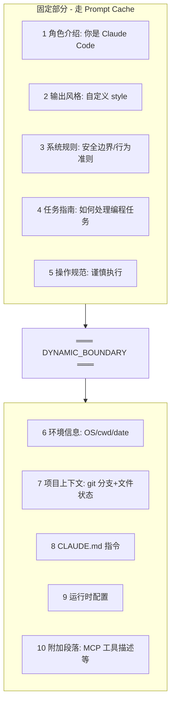

# 03 · Claude Code 泄漏源码分析

> 2026-03-31，Anthropic 在发布 Claude Code v2.1.88 时误把 `cli.js.map`（压缩前源码映射，60MB）一起推到了 npm。社区在第一时间镜像下载并反编译 —— **51.2 万行 TypeScript、1903 个文件、4756 个模块**。这是工业级 Agent 史上最大规模的"事故级"开源，比起读博客学架构，这直接把一家头部 AI Lab 最好的 Agent 工程摊开在桌面上。[1]

## 3.1 事件时间线

| 时间 | 事件 |
| --- | --- |
| 2025-02 | Claude Code v1 版首次误发 map 文件，社区低调保留 |
| 2026-03-31 | v2.1.88 再次误发，社区两小时内完成镜像。第二次了 |
| 2026-04-01 | Anthropic 从 npm 删除，但镜像已扩散 |
| 2026-04-02 | `SatoMini/claude-code-source-map` 等公开仓库出现 |
| 2026-04 上旬 | 社区中文深度拆解文（29 子系统、6 层压缩、100+ 命令）[1] |
| 2026-04 中旬 | Rust / Python 重写项目开始出现交叉验证 |

社区镜像清单（避免点名某个仓库挂掉）：

- `github.com/SatoMini/claude-code-source-map`
- `github.com/dnakov/claude-code`
- `github.com/iamdin/Claude-Code-Leak`
- `github.com/instructkr/claude-code`

## 3.2 代码体量一张表

| 维度 | 数字 |
| --- | --- |
| 模块（`src/**/*.ts`） | 4756 |
| 文件 | 1903 |
| 行数 | ~512,000 |
| 子系统（目录一级） | 29 |
| 工具组 | 43（184 个工具实现文件） |
| 内置命令 | 100+ |
| 启动阶段 | 7 |
| 上下文压缩层 | 6 |
| 扩展层 | 4（Command / Skill / Plugin / MCP） |
| 权限等级 | 3（Read / WorkspaceWrite / Danger） |

技术栈：TypeScript + Bun + React/Ink（终端 UI）+ Zod v4（校验）+ `@anthropic-ai/sdk` + MCP SDK [1]。

## 3.3 七阶段启动流程


关键判断：

- **信任门（trust gate）在第 3 步**：不信任环境下，plugin + MCP 都不加载 —— 类比 Android "未知来源"开关。
- 第 4 步和第 5 步分界很关键：无风险的 `setup()` 并行先行，有风险的扩展等信任通过才启动。
- 第 6 步的 6 种运行模式共享同一套核心逻辑 —— 通过依赖注入切换传输层，类似 Spring Profile [1]。

## 3.4 System Prompt 的十层结构

每次对话 Claude 收到的"隐藏剧本"由 10 段严格顺序拼接，中间用 `DYNAMIC_BOUNDARY` 分开 —— 线上走 prompt cache，线下每次重生成。[1]



工程启示：

- 段落顺序必须稳定（工具列表变一位次序，cache 全失效）。
- CLAUDE.md 永远不会被压缩 —— 因为它在 system prompt 里而不是 messages 里。
- 工具 schema 改一个字段都会击穿 cache，所以工具描述变动要谨慎。

## 3.5 QueryEngine 对话主循环

核心参数（TS 版 / Rust 重写版在括号内）：

| 参数 | 值 | 含义 |
| --- | --- | --- |
| `max_turns` | 8 (Rust 16) | 单轮对话最多工具循环次数 |
| `max_budget_tokens` | 2,000 | 单次请求 budget 上限 |
| `compact_after_turns` | 12 | 超过该轮次自动压缩 |
| token 估算 | `字符数/4 + 1` | 不调 tokenizer，省开销 [1] |
| 重试策略 | 200ms → 400ms → 800ms，最多 2 次 | HTTP 429/5xx 自动退避 |

伪代码（取自泄漏反编译与 Rust 重写的交叉核对）：

```typescript
async function run_turn(userInput: string) {
  session.push(UserMessage(userInput));
  for (let turn = 0; turn < max_turns; turn++) {
    const events = await api.stream(systemPrompt, session.messages);
    const msg = buildMessage(events);           // 累积 TextDelta + 拼 ToolUse
    session.push(msg);
    const tools = extractToolUses(msg);
    if (tools.length === 0) break;              // 正常结束
    for (const tool of tools) {
      const result = await orchestrator.execute(tool);
      session.push(ToolResult(result));
    }
    if (shouldAutoCompact(session)) autoCompact(session);
  }
}
```

### 流式拼图

Claude 回复通过 SSE `content_block_delta` 逐字推送。关键行为：**ToolUse 事件会打断累积的文字**，flush 当前 text 块 → 新起 ToolUse 块。这样每条 assistant message 都是 `[Text..., ToolUse{...}, Text..., ToolUse{...}]` 的有序列表。MessageStop 触发最后一次 flush。[1]

## 3.6 六层上下文压缩

这是整套源码里最值得学的一部分。**按触发顺序从轻到重**：

| 层 | 名称 | 触发条件 | 动作 | 类比 |
| --- | --- | --- | --- | --- |
| 1 | tool_result 预算截断 | 每次工具返回 | 按 token 截到阈值，超出标 `[snipped]` | 快递单太长只留前半页 |
| 2 | snip compact | 旧工具结果 | 整体替换为 `[snipped]`，保留消息结构 | 会议记录删附件留标题 |
| 3 | microcompact | prompt cache 失效 | 轻量修复 cache baseline | Redis 预热而非全量重建 |
| 4 | autoCompact | `messages > 12` | 保留最后 N 条，前面生成摘要 | 秘书浓缩旧笔记 |
| 5 | reactiveCompact | API 报 `context_length_exceeded` | 紧急压缩后重试 | 硬盘满了清临时文件 |
| 6 | context collapse | 最后手段 | 在 `compact_boundary` 处重置，`/resume` 从断点恢复 | 数据库 checkpoint 恢复 |

### `summarize_messages()` 保留的 7 类信息

压缩摘要不是随便写的，而是精确抽出：

1. 消息统计（user/assistant/tool 各几条）
2. 工具清单（去重+排序）
3. 最近 3 条用户请求（每条截 160 字符）
4. 待办事项（搜 `TODO / NEXT / PENDING / FOLLOW UP / REMAINING`）
5. 关键文件路径（扩展名 `.rs .ts .tsx .js .json .md`，最多 8 个）
6. 当前工作推断（最后一条非空 text 块，截 200 字符）
7. 完整时间线（每条消息角色+摘要，每块 160 字符）

**实战意义**：想让 Claude 压缩后还记得某事？用 `TODO:` 或 `NEXT:` 前缀；想让它记得某文件？对话里写完整路径 [1]。

## 3.7 四层扩展体系

| 层 | 类型 | 数量 | 定义方式 | 类比 |
| --- | --- | --- | --- | --- |
| 1 Command | 硬编码 TS 函数 | 100+ | 代码里写死 | `@Controller` 方法 |
| 2 Skill | Markdown + 条件匹配 | 20 模块 | `~/.claude/skills/*.md` | `@ConditionalOnProperty` |
| 3 Plugin | 能力包 | 市场化 | 一个包注册命令/skill/hook/MCP/Agent | Spring Boot Starter |
| 4 MCP | 外部协议 | 5 种传输 | 独立进程通信 | JDBC 连接任意数据库 |

MCP 握手细节：

- 工具命名 `mcp__{server}__{tool}`，双下划线分隔，非字母数字替换为 `_`
- 消息帧用 HTTP 风格 `Content-Length: N\r\n\r\n{...}`（JSON 内容可能含 `\n`，靠长度前缀精确切分）
- 目前只有 stdio 真正完整实现，其他（SSE/HTTP/WS/claudeai-proxy）优雅降级为"不支持但不报错"[1]

## 3.8 工具运行时 43 组

所有工具实现同一个接口：`call` / `checkPermissions` / `render` / `isReadOnly`。

| 类别 | 工具 | 说明 |
| --- | --- | --- |
| 核心 | BashTool(18 文件) / FileRead(5) / FileEdit(6) / FileWrite(3) / Glob(3) / Grep(3) / WebFetch(5) / WebSearch(3) | 几乎每次对话都用 |
| AI 代理 | **AgentTool(20)** - 含 7 种内置 sub-agent | 最大工具！codeGuide/explore/generalPurpose/plan/verification 等 |
| 任务管理 | TaskCreate/Get/List/Update/Stop (17) + TodoWrite (3) | 完整 CRUD |
| 规划/配置 | EnterPlanModeTool(4) / LSPTool(6) / ScheduleCronTool(5) / PowerShellTool(14) | 杂项 |

关键工程细节：

- **StreamingToolExecutor**：读操作可并发，写操作串行（数据库读写锁思路）
- **工具注册顺序稳定**：因为工具列表进了 system prompt，顺序变了 cache 就失效
- **denial 追踪**：`deniedTools.add(toolId)` 防止"请求→拒绝→再请求"死循环 [1]

## 3.9 三级权限系统

| 级别 | 能做什么 | 需要用户确认 |
| --- | --- | --- |
| 🟢 ReadOnly | 读文件/搜索/浏览网页 | 否 |
| 🟡 WorkspaceWrite | 修改项目文件/管理任务 | 否（在工作区内） |
| 🔴 DangerFullAccess | 执行任意命令/安装软件 | 是，弹确认框 |

`authorize()` 伪代码：

```typescript
function authorize(toolName: string, currentMode: Permission) {
  const required = toolRequirements[toolName] ?? DangerFullAccess;  // 未注册 = 最高权限
  if (currentMode >= required) return Allow;
  if (currentMode === WorkspaceWrite && required === DangerFullAccess) return prompter.askUser();
  return Deny;  // 差距太大直接拒
}
```

**注意**：未注册工具默认最高权限 —— 宁可多拦不漏放。只有一条升级路径 `WorkspaceWrite → DangerFullAccess`；`ReadOnly` 不能直升 Danger [1]。

## 3.10 持久化 8 层

| 层 | 模块 | 作用 |
| --- | --- | --- |
| ⚡ 进程级 | `bootstrap/state.ts` | Java static 变量 |
| 🗄️ Zustand | `AppStateStore` (6 文件) | 轻量状态管理 |
| 📜 会话 | `sessionStorage.ts` JSONL | `/resume` 恢复核心 |
| ⌨️ 输入历史 | `history.ts` | 上下箭头翻历史 |
| 📌 压缩断点 | `compact_boundary` 标记行 | `/resume` 向前扫到就停 |
| 📷 文件快照 | `fileHistory` | 内容哈希去重，可回退 |
| 🧠 长期记忆 | `memdir/MEMORY.md` (8 文件) | 跨会话 + 年龄管理 |
| 📊 观测 | OpenTelemetry + Datadog | 每次工具耗时可见 |

JSONL 格式示例：

```json
{"role":"user","content":"帮我读一下 README","ts":1710000001}
{"role":"assistant","content":[{"type":"text","text":"让我读一下"},{"type":"tool_use","id":"t1","name":"FileReadTool"}],"ts":1710000002}
{"role":"tool","content":[{"type":"tool_result","tool_use_id":"t1","content":"# My Project..."}],"ts":1710000003}
{"role":"assistant","content":[{"type":"text","text":"文件内容是..."}],"usage":{"input_tokens":1200,"output_tokens":45},"ts":1710000004}
{"type":"compact_boundary","summary":"对话已压缩...","ts":1710000005}
```

- JSONL 优势：追加写、崩溃不丢、可尾部读取
- 凭证原子写入：先写 `.tmp` 再 `rename`，崩溃不损坏
- base64url 手写实现：用 `-_` 替 `+/`，无填充 `=`（OAuth PKCE 场景）[1]

## 3.11 成本定价（源码硬编码）

| 模型 | 输入 | 输出 | 缓存写 | 缓存读 |
| --- | --- | --- | --- | --- |
| Haiku | $1 | $5 | $1.25 | $0.10 |
| Sonnet (默认) | $15 | $75 | $18.75 | $1.50 |
| Opus | $15 | $75 | $18.75 | $1.50 |

单位 `$/百万Token`。模型识别用字符串 `.includes("haiku")`[1]。**输出价 = 输入价 × 5** → 让 AI 少废话比压输入更省钱。

## 3.12 CLAUDE.md 发现逻辑

```
for dir in [当前目录, 父目录, 祖父目录, ..., /] {
  检查 dir/CLAUDE.md           // 项目规则 (Git)
  检查 dir/CLAUDE.local.md     // 本机规则 (不提交)
  检查 dir/.claude/CLAUDE.md   // 隐藏目录版
  检查 dir/.claude/instructions.md  // 别名
}
// 去重：内容哈希 u64
// 单文件 ≤ 4000 字符，总预算 ≤ 12000 字符
```

内容被包装在 `# Claude instructions` section 里，每个文件带路径和作用域标注。加载顺序从根目录到当前目录（祖先优先），去重先到先留 [1]。

## 3.13 特色子系统亮点

| 子系统 | 看点 |
| --- | --- |
| BUDDY | 6 文件实现终端内 Tamagotchi，18 种情绪，宠物根据你写 bug 伤心（`/buddy` 激活） |
| COORDINATOR | `coordinatorMode.ts` 多 Agent 任务分配与结果汇总（`/ultraplan` 启动） |
| BRIDGE | 31 文件，TypeScript ↔ Rust 原生模块桥（音频/图片/键盘修饰符/URL） |
| VIM 模式 | 5 文件，支持 hjkl/dd/yy 等常用操作（`/vim` 切换） |
| MIGRATIONS | 11 文件，配置版本迁移脚本（类比 Flyway） |
| Git Worktree 隔离 | 子 Agent 改代码不污染主目录；`EnterWorktreeTool/ExitWorktreeTool` |

## 3.14 KAIROS 守护模式 & Undercover Mode

> 说明：以下内容来自社区拆解，未在官方文档出现。

- **KAIROS**：社区推测名，等同于"agentic misalignment 监测"的内部 guard，会在某些敏感动作（删文件、推送 prod）前额外插入检查 prompt。
- **Undercover Mode**：疑似"反蒸馏"机制 —— 检测到可疑 harness 正在整条提取 Claude 行为时，降级输出或轻微扰动回答。社区推测，尚无官方声明。

## 3.15 从这份泄漏我们学到什么

1. **把 Agent 当操作系统做**：29 个子系统不多不少，是一个"AI OS" 的合理复杂度。
2. **Prompt Cache 是第一省钱手段**：`DYNAMIC_BOUNDARY` + 稳定工具顺序，是工程级省钱的天花板。
3. **六层压缩不是一次做到位**：从最轻的截断到最重的 checkpoint，按触发条件分层 —— 任何一层只干一件事。
4. **权限默认最严**：未注册工具 = 最高权限，比"默认允许"安全太多（对比 OpenClaw 的反面教材，见 05 章）。
5. **第二次事故同样的原因**：源码映射文件的 npm 发布是个纯工程流程问题，这也提醒做 CLI 工具时一定要 `.npmignore` 审得死。

## 参考来源

访问日期：2026-04-18。

1. 子昕. 《Claude Code 源码意外泄露，我连夜拆了个底朝天：29 个子系统、6 层压缩、100+ 隐藏命令》. 技术栈 2026-04. https://jishuzhan.net/article/2039650796173266946
2. 《深入解析 Claude Code 提示词工程》. 腾讯云社区 2026-04. https://cloud.tencent.com/developer/article/2650386
3. SatoMini/claude-code-source-map. https://github.com/SatoMini/claude-code-source-map
4. dnakov/claude-code（镜像仓库，可能已删）. https://github.com/dnakov/claude-code
5. instructkr/claude-code 韩文社区拆解. https://github.com/instructkr/claude-code
6. Anthropic Engineering. *Effective harnesses for long-running agents*. https://www.anthropic.com/engineering/effective-harnesses-for-long-running-agents
7. Anthropic Engineering. *Scaling Managed Agents*. https://www.anthropic.com/engineering/managed-agents
