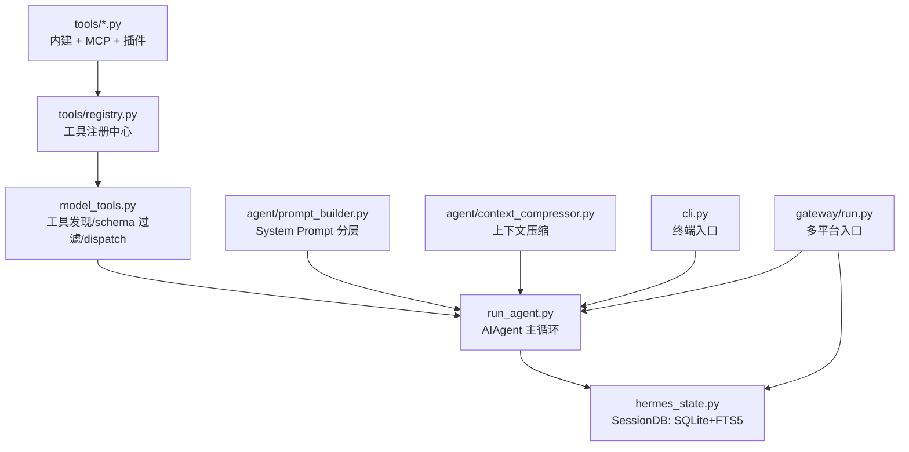
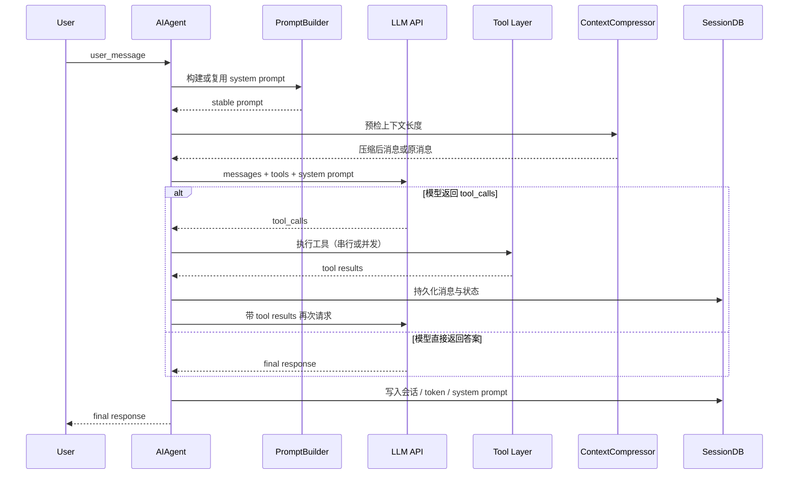
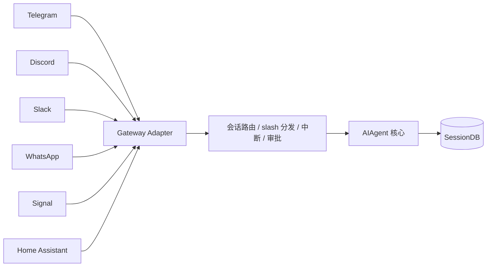

# 04 · Hermes Agent 实现原理

> Hermes Agent（`nousresearch/hermes-agent`）是 NousResearch 开源的 Python Agent 框架，在 2025-2026 出圈靠的是"不是又一个 Agent，而是真的在做代理操作系统"这个定位。这一章的价值在于：它完全开源可读，和 Claude Code（闭源但泄漏）形成完美对照，你可以在 Hermes 源码里验证第 02/03 章提到的设计决策。[1]

## 4.1 项目定位：代理操作系统

Hermes 在 README 里自称 *self-improving AI agent*，实际上更准确的描述是"长期运行、跨入口复用、自己管理上下文与状态的代理操作系统"[1]。

和两个参考物的快速对比：

| 维度 | Claude Code | Hermes Agent | OpenClaw |
| --- | --- | --- | --- |
| 开源 | 闭源（泄漏） | ✅ Apache 2.0 | ✅ MIT |
| 语言 | TypeScript + Bun | Python 3.11+ | TypeScript + Node |
| 入口 | CLI + 远程 + teleport | CLI + 6 种 IM Gateway | CLI + iOS/macOS + web |
| 核心文件体量 | `cli.js.map` 60MB | `run_agent.py` 9376 行 | TS ~100+ 文件 |
| 记忆 | CLAUDE.md + memdir + JSONL | **SQLite + FTS5** | memdir + config |
| Sandbox | 无（OS 级权限） | Local/Docker/SSH/Daytona/Modal/OpenShell 6 种 | Docker/SSH/OpenShell |
| MCP | 一等公民 | 统一进 registry | 一等公民 |
| 典型目标 | 开发者日常编码 | 个人长期助理 + IM 机器人 | 桌面通用 AI 助手 |

## 4.2 核心文件行数（敬畏心项）

作者读源码时最直观的冲击是"这项目真的大"。关键文件 [1]：

| 文件 | 行数 | 职责 |
| --- | --- | --- |
| `run_agent.py` | 9376 | AIAgent 主循环 |
| `cli.py` | 8418 | 终端交互（prompt_toolkit） |
| `gateway/run.py` | 7629 | 多平台 gateway（Telegram/Discord/Slack/WA/Signal/HA） |
| `tools/mcp_tool.py` | 1855 | MCP 客户端适配 |
| `tools/terminal_tool.py` | 1580 | 终端执行器 |
| `agent/prompt_builder.py` | 866 | System prompt 分层拼装 |
| `agent/context_compressor.py` | 649 | 上下文压缩五步 |

**51 个工具**通过 `registry.register(...)` 注册 —— 不是小打小闹，真把工具系统当 Agent 栈的一部分。

## 4.3 依赖图（Mermaid）



这张图背后的架构判断：**工具能力不反向绑死主循环**。`run_agent.py` 只需知道"有什么工具/哪些可用/schema 给模型看到哪些/调用分发给谁"，实现细节全在 registry 后面。[1]

## 4.4 AIAgent 主循环时序



主循环骨架很朴素：

```python
while api_call_count < self.max_iterations and self.iteration_budget.remaining > 0:
    ...
```

但 `run_conversation()` 在这个 `while` 周围塞进了 9 类"真实世界复杂度"[1]：

1. 会话级 system prompt 缓存
2. 上下文预压缩
3. 工具调用并发/串行判定
4. 中断与恢复
5. provider / api_mode 兼容（Anthropic/OpenAI/本地/OpenRouter）
6. memory prefetch
7. hook 生命周期
8. token 与成本统计
9. fallback model 切换

## 4.5 System Prompt 的七层（Hermes 版）

`_build_system_prompt()` 显式分层：

```python
# 1. Agent identity
# 2. User / gateway system prompt
# 3. Persistent memory
# 4. Skills guidance
# 5. Context files (AGENTS.md / SOUL.md / ...)
# 6. Current date & time
# 7. Platform-specific formatting hint
```

关键设计：

- **缓存**：`self._cached_system_prompt` 只构造一次，优先 prompt cache 命中 —— 和 Claude Code 的 `DYNAMIC_BOUNDARY` 背后的判断一致 [1][2]。
- **ephemeral vs persistent**：短期指令、运行期噪音走 `ephemeral_system_prompt`，不进缓存。
- **AGENTS.md 不天然可信**：扫描 `_CONTEXT_THREAT_PATTERNS`（如 `r'ignore\s+(previous|all|above|prior)\s+instructions'`）—— 把本地配置当 prompt injection vector 处理，这一点几乎没有别的开源 Agent 做到。[1]
- **平台提示后置注入**：CLI / Telegram / WhatsApp / Signal 的格式提示封在 `PLATFORM_HINTS`，给"同一个大脑"接不同输出外设。

## 4.6 工具系统：三件套 + MCP

### 三件套的 API

```python
class ToolRegistry:
    def register(...)           # 注册工具（自描述 schema）
    def get_definitions(...)    # 给模型看的 schema（会动态过滤）
    def dispatch(...)           # 根据 tool_call 路由到 handler

def _discover_tools():
    _modules = [
        "tools.web_tools",
        "tools.terminal_tool",
        "tools.file_tools",
        ...
    ]
    # 导入即注册
```

### `check_fn` / `requires_env` —— 被低估的小钩子

每个工具注册时可带 `check_fn`（可用性判断）和 `requires_env`（需要的环境变量）。价值：

> 工具的可用性不必等到运行时报错才知道。可以在暴露 schema 给模型之前先过滤。

对模型来说，"看见但调不了"会诱发幻觉，"压根看不见"反而干净。`get_tool_definitions()` 还会动态修 schema，剥掉会误导模型的 cross-reference [1]。

### MCP 统一走 Registry

`discover_mcp_tools()` 最终也是塞回 `registry.register()`：

```python
registry.register(
    name=tool_name_prefixed,
    toolset=toolset_name,
    schema=schema,
    handler=...,
)
```

→ 对上层来说，内建工具、MCP 工具、插件工具不是三套世界观。这比 Claude Code 的 `mcp__{server}__{tool}` 命名空间方案更统一 —— 没"MCP 专区"，就是工具。

## 4.7 ContextCompressor —— 整个项目最值得抄的模块

很多 Agent 项目的"压缩"就三步：超了 → 总结 → 继续聊。这种做法的问题是只省 token，不管任务能不能接得住。

Hermes 的五步（对应 `agent/context_compressor.py`）：


### 三个必须抄的细节

1. **按 token 预算保护尾部，而不是最后 N 条消息** —— 因为工具输出和一句话差两个数量级，按条数算没意义 [1]。
2. **Summary 写成"交接单"而不是摘要**，必须包含这 7 类：
   - Goal
   - Constraints & Preferences
   - Progress
   - Decisions
   - Files
   - Next Steps
   - Tools & Patterns
   → 长对话最怕的不是忘词，是断片。
3. **修复 orphaned tool_call / tool_result 配对**：压缩后消息序列若含孤立的 tool_call，多数 LLM 会报协议错。Hermes 专门处理这个一致性。

这三点加在一起，是"压缩按运行时正确性标准做"而不是"按少花 token 标准做"的分水岭。[1]

## 4.8 SessionDB：SQLite + FTS5 不是因为高级，是因为合适

`hermes_state.py` 的设计：

```sql
PRAGMA journal_mode = WAL;   -- 多读少写友好

CREATE VIRTUAL TABLE IF NOT EXISTS messages_fts USING fts5(
    content,
    content=messages,
    content_rowid=id
);
```

匹配 Agent 的真实使用场景：

| 需求 | SQLite+FTS5 是否合适 |
| --- | --- |
| 单机部署 | ✅ 零运维 |
| 多轮会话重要 | ✅ ACID + WAL |
| 跨会话检索历史消息 | ✅ FTS5 原生 |
| 不想维护 Postgres | ✅ 不用 |
| 向量检索 | ❌（需要叠 Chroma/Qdrant） |

`search_sessions()` 还对 FTS5 查询语法做了清洗（引号、括号、点号、连字符），避免一个错误查询把全文检索打炸 —— 这说明作者想的是 "真长期使用"，不是 "有这个功能"。[1]

## 4.9 Profile 机制：同一套代码多个人格

`HERMES_HOME` + profile override 把配置 / sessions / memory / skills / gateway 全隔离。同一台机器上可以跑多个互不打架的代理实例，每个带自己的"系统人格"[1]。

## 4.10 Gateway：同一个大脑，不同的输出外设



共享 `COMMAND_REGISTRY`，根据平台能力做门控。`KawaiiSpinner` 为兼容 `prompt_toolkit` 特意避开 `\033[K` 转而用空格覆盖 —— 这种细节说明作者真的在终端里被渲染问题折磨过 [1]。

## 4.11 Executor：6 种沙盒后端

Hermes 对 Agent 最危险的动作（跑命令/改文件）提供 6 种执行后端：

| 后端 | 适用 | 隔离度 |
| --- | --- | --- |
| Local | 本机直跑 | 🔴 无 |
| Docker | 本地容器 | 🟢 强 |
| SSH | 远程机器 | 🟡 中（对方决定） |
| Daytona | Daytona workspace | 🟢 强 |
| Modal | Modal cloud container | 🟢 强 |
| OpenShell | Cordum/OpenShell | 🟢 强 |

对比 OpenClaw 默认 Local 的坑（见 05 章），Hermes 在 README 强烈推荐生产环境切到 Docker/Daytona/Modal。

## 4.12 三层记忆

| 层 | 存储 | 典型数据 |
| --- | --- | --- |
| **Episodic**（事件） | SQLite + FTS5 messages 表 | 过去的用户请求、动作、结果 |
| **Semantic**（知识） | `MEMORY.md` + 向量存储（可选） | "你喜欢用 TypeScript" 这类事实 |
| **Procedural**（流程） | Skills 目录下的 Markdown | 可复用 how-to |

这对应 07 章 Memory 部分的基础理论。

## 4.13 取舍：作者的实话实说

Hermes 的原作者不避讳缺点 [1]：

1. **优先扩展性，不是极简**：所以核心文件很大。代价是新读者门槛高。
2. **优先"跑得稳"，不是"看起来最优雅"**：provider 兼容、fallback、hook、usage、prompt cache 特判、压缩边界处理 —— 这些都是现实兜底逻辑。
3. **适度中心化**：`run_agent.py` 9376 行就像公司里"什么都懂什么都能顶"的核心同事 —— 能撑住，但下一步必须继续拆。

## 4.14 值得照抄的 5 个工程决定

1. 系统 prompt 要稳定 → 缓存命中 > 灵活拼装。
2. 工具协议先统一，再谈功能爆炸。
3. 上下文压缩按 token 预算 + 结构化交接单 + 协议配对修复。
4. 本地 AGENTS.md 也要做 injection 检测。
5. 同一大脑多平台入口，共用 COMMAND_REGISTRY。

## 参考来源

访问日期：2026-04-18。

1. 袋鱼不重. 《我把 Hermes Agent 源码扒了个底朝天：它不是"又一个 AI Agent"，而是在认真造一套代理操作系统》. 技术栈. https://jishuzhan.net/article/2043600744415297538
2. 《Hermes Agent 内部机制详解》. CSDN GitCode. https://gitcode.csdn.net/69d8bbe254b52172bc686279.html
3. 一个小浪吴啊. 《Linux/Mac Hermes Agent 部署教程》. https://jishuzhan.net/article/2045301630011244546
4. 赵钰老师. 《Hermes Agent 技能封装与科研自动化》. https://jishuzhan.net/article/2045293654286336001
5. NousResearch/hermes-agent 官方仓库. https://github.com/nousresearch/hermes-agent
6. Skill 机器人 vs Hermes Agent 对比. https://jishuzhan.net/article/2045118201143558146
