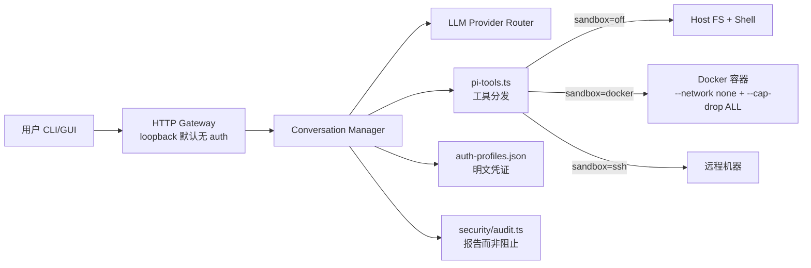
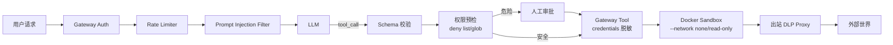

# 05 · OpenClaw 实现原理 + 安全问题 + 沙盒

> OpenClaw（`openclaw/openclaw`）是 Steipete（PSPDFKit 创始人）发起的开源桌面 AI 助手，2025 下半年到 2026 一路涨到 **360K star**，成为开源 Agent 顶流。但它同时也是过去一年里被安全社区"锤"得最狠的项目 —— 因为它展示了一件事：**工程能力很强的团队，用 AI 高速写代码，仍然可能得到一个"默认裸奔"的安全架构**。[1]

## 5.1 项目概览

| 维度 | 值 |
| --- | --- |
| 仓库 | `openclaw/openclaw`（2025-11 改过一次命名）|
| Star | ~360K（2026-04）|
| 语言 | TypeScript（+ iOS Swift 子项目）|
| 定位 | Your own personal AI assistant. Any OS. Any Platform. The lobster way.[1] |
| 支持模型 | Claude / OpenAI / Gemini / 本地 Ollama / 任意 OpenAI 兼容 |
| 部署形态 | CLI + 桌面 GUI + iOS/macOS app |
| 默认 Sandbox | **`off`**（参见 5.3）|

核心目录（根据 Issue 代码引用拼出来的）[1]：

```
src/
  agents/
    pi-tools.ts           # 工具分发入口
    sandbox/
      config.ts           # 沙盒配置（mode="off" 默认）
    sandbox-paths.ts      # 路径白名单
    auth-profiles/
      store.ts            # 凭证存储（明文 JSON）
  security/
    audit.ts              # 37KB 的安全审计工具
  gateway/                # HTTP gateway（无全局 auth）
apps/
  ios/Sources/Gateway/
    KeychainStore.swift   # iOS 端正确做了 keychain
```

## 5.2 架构速览



这张图里红线很多：loopback gateway 无 auth、sandbox 默认 off、凭证明文、审计只报告不阻止 —— 每一个都能独立成为安全事件。

## 5.3 四大默认安全风险（Issue 证据）

### 风险 1：Workspace ≠ Sandbox

官方文档 `docs/concepts/agent-workspace.md` 自己写了 [1]：

> The workspace is the **default cwd**, not a hard sandbox. Tools resolve relative paths against the workspace, but **absolute paths can still reach elsewhere on the host** unless sandboxing is enabled.

代码佐证（`src/agents/pi-tools.ts`）[1]：

```typescript
if (tool.name === readTool.name) {
  if (sandboxRoot) {
    return [createSandboxedReadTool(sandboxRoot)];  // Only when sandbox ON
  }
  const freshReadTool = createReadTool(workspaceRoot);  // Default: NO path restrictions
  return [createOpenClawReadTool(freshReadTool)];
}
```

实际后果：

- `read({ path: "~/.ssh/id_rsa" })` ✅ 成功
- `read({ path: "~/.aws/credentials" })` ✅ 成功
- `read({ path: "/etc/shadow" })` ✅ 成功（如果以 root 运行）
- `exec({ command: "rm -rf ~" })` ✅ 成功

### 风险 2：Sandbox 默认关闭

代码佐证（`src/agents/sandbox/config.ts:137`）[1]：

```typescript
return {
  mode: agentSandbox?.mode ?? agent?.mode ?? "off",  // DEFAULT "off"
  ...
}
```

Docker 沙盒的实现其实是合格的，隔离标志齐备：`--network none` / `--cap-drop ALL` / `--read-only` / `--security-opt no-new-privileges`。**但它是 opt-in，默认关闭** —— 大多数用户根本不知道要去配置。

### 风险 3：凭证明文存储

代码佐证（`src/agents/auth-profiles/store.ts:283-291`）[1]：

```typescript
export function saveAuthProfileStore(store: AuthProfileStore, agentDir?: string): void {
  const authPath = resolveAuthStorePath(agentDir);
  const payload = {
    version: AUTH_STORE_VERSION,
    profiles: store.profiles,  // raw API keys
    ...
  };
  saveJsonFile(authPath, payload);  // plaintext JSON
}
```

落地路径：`~/.openclaw/agents/*/agent/auth-profiles.json`，任何 malware / 恶意浏览器扩展 / 被黑的进程都能读。

**讽刺的是** iOS 子项目用的是正确的 Keychain（`apps/ios/Sources/Gateway/KeychainStore.swift`），CLI/Server 没做。[1]

### 风险 4：审计工具只"报告"不"阻止"

`src/security/audit.ts` 是一个 37KB 的审计程序，它能检测到：

- Missing gateway authentication
- File permission 问题
- 危险配置项
- Channel security 漏洞

审计工具把 `gateway.loopback_no_auth` 标为 **critical**。但它是后验工具 —— 用户必须手动跑 `openclaw security audit` 才知道自己裸奔。[1]

Issue 作者 @joshyorko 的原话：

> 这是本末倒置。安全应该是预防性的，不是被动响应。

### 其他被列出的问题

| 类别 | 问题 |
| --- | --- |
| 网络 | 无 CORS 拒绝策略 |
| 鉴权 | 每条路由各自实现 auth（易漏） |
| 会话 | Token 不过期 |
| 限速 | 无 rate limit（shell 执行 + 无限流 = 资源耗尽攻击） |
| 日志 | 无审计日志 |
| 最小权限 | 所有认证用户拥有完全能力 |
| 凭证轮换 | 不支持 |
| 安全响应头 | 无 CSP / X-Frame-Options |
| 输入消毒 | 用户输入直送 prompt（注入向量） |

## 5.4 相关 Issue 索引

| 编号 | 主题 | 状态 |
| --- | --- | --- |
| #7139 | **Critical: Default configuration provides zero isolation** | closed [1] |
| #7827 | 绝对路径越狱 | open/追踪中 |
| #8588 | `sandboxRoot=~` 导致 `~/.openclaw/` 仍在沙盒内 | 讨论中 |
| #13683 | 配置中 `${ENV}` 解析后可通过 `config get` 被 Agent 读回 | open |
| #10410 | "openclaw bot deleted home folder" 真实破坏事件 | closed（加警告） |
| #17299 | Agents Plane 多租户隔离方案 | 提案 |
| #22170 | Cordum 外部 orchestration 层提案 | 提案 |

## 5.5 Docker 沙盒最小启用配置

如果你今天就要用 OpenClaw，第一件事是打开 Docker 沙盒。最小 JSON5（`~/.openclaw/openclaw.json`）：

```json5
{
  "agent": {
    "sandbox": {
      "mode": "docker",
      "docker": {
        "image": "ghcr.io/openclaw/sandbox:latest",
        "networkMode": "none",
        "capDrop": ["ALL"],
        "readOnly": true,
        "securityOpts": ["no-new-privileges"],
        "memLimit": "2g",
        "pidsLimit": 128
      },
      "sandboxRoot": "/workspace",
      "writableMounts": ["/workspace"]
    },
    "permissions": {
      "autoApproveRead": false,
      "autoApproveWrite": false,
      "autoApproveExec": false
    }
  },
  "gateway": {
    "bindHost": "127.0.0.1",
    "requireAuth": true,
    "corsAllowOrigins": []
  },
  "credentials": {
    "store": "keychain"
  }
}
```

## 5.6 解决方案总表

| 风险 | 当前默认 | 建议对策 |
| --- | --- | --- |
| 无路径隔离 | workspace = cwd | sandbox.mode=docker + sandboxRoot 显式路径 |
| 凭证明文 | `auth-profiles.json` | OS Keychain（`credentials.store=keychain`）|
| Gateway 无 auth | loopback 无 auth | 设 `requireAuth=true` + 随机 token |
| 沙盒 off | default `off` | 强制 `docker` / `ssh` / `openshell` |
| 审计被动 | 只检测 | 用外部 gate：Pipelock / Cordum（见 10 章）|
| 工具无白名单 | 全工具默认开 | 在 settings 里用 glob 显式列白名单 |
| `${ENV}` 泄漏 | `config get` 读回 | Gateway Tool Pattern：Agent 只看到脱敏值（见下）|

### Gateway Tool Pattern（从 Anthropic Managed Agents 借来）

```mermaid
flowchart LR
    A[Claude/Agent] -->|调用"读 API key"工具| P[Tool Proxy]
    P -->|鉴权后| V[(Secret Vault)]
    P -->|直接发请求| X[外部 API]
    P -->|只返回结果| A
```

要点：Agent 永远不看到凭证本体，只看到 proxy 暴露的脱敏名字 + 最终结果。和"把 token 写进 `config get` 里再让 Agent 读"是两个世界 [2]。

## 5.7 防护路径 Mermaid



## 5.8 深层讨论：AI 生成代码的默认不安全

@joshyorko 的追评击中要害 [1]：

> 现代 LLM 完全能处理这些安全要求，**前提是 prompt 里带了正确约束**。失败根源在于 AI 被调教成"快速出功能"而非"生产就绪"。如果 system instruction 里塞了 Google SRE Handbook / Susan Fowler 的 Production-Ready Microservices / OWASP 原则，LLM 根本不会输出明文凭证或非沙盒默认。

这指向一个更大的问题：**把"Security Context"当成 AI 编码的一等依赖**（和 09 章 Context Engineering 呼应）。反面案例，Django 开箱就有 CSRF / SECRET_KEY / ORM 防注入 / CSP / CORS —— 框架强迫你做安全决定，而 Express/Node 生态什么都得自己加。

## 5.9 替代方案 / 加固层

| 名字 | 作用 | 地位 |
| --- | --- | --- |
| **Cordum** | 外部 orchestration 层：每个 tool call 先过策略评估（deny/escalate/allow），凭证集中管理 | Issue #22170 提案中 |
| **Pipelock** | 出站 DLP 代理：拦截外部流量，防敏感数据外带 | 社区产品 |
| **Lakera Guard / Rebuff** | Prompt injection 分类器 | 通用 |
| **NeMo Guardrails** | 输入/输出 rule 拦截 | NVIDIA |
| **OpenShell/Daytona/Modal** | 带隔离的执行沙盒 | 可替代 OpenClaw 的 Local 后端 |

## 5.10 从 OpenClaw 学到的 5 条通用经验

1. **默认不安全 = 绝大多数用户不安全**。再好的审计工具也救不了 opt-in 的安全设计。
2. **审计是预防的最后防线，不是第一道**。能在默认配置里关掉的风险就不要放进审计工具去"告诉用户"。
3. **平台差异不应成借口**。同一个项目 iOS 能 Keychain，CLI 却明文 JSON —— 说明有技术能力但没有标准。
4. **AI 生成代码需要"安全上下文"做 prompt**。给 Codex / Claude 一份 SRE+OWASP 当 system 指令，比事后审计便宜很多。
5. **外部安全层（Cordum 等）是可行的补丁**。业务逻辑不该重写安全，但编排层可以加。

## 参考来源

访问日期：2026-04-18。

1. OpenClaw Issue #7139 *Critical: Default configuration provides zero isolation*. https://github.com/openclaw/openclaw/issues/7139
2. Anthropic Engineering. *Scaling Managed Agents: Decoupling the brain from the hands* — Gateway Tool pattern. https://www.anthropic.com/engineering/managed-agents
3. OpenClaw Issue #7827（绝对路径越狱）. https://github.com/openclaw/openclaw/issues/7827
4. OpenClaw Issue #8588（`sandboxRoot=~` 仍含家目录）. https://github.com/openclaw/openclaw/issues/8588
5. OpenClaw Issue #13683（`config get` 泄漏解析后 ENV）. https://github.com/openclaw/openclaw/issues/13683
6. OpenClaw Issue #10410 *openclaw bot deleted home folder*. https://github.com/openclaw/openclaw/issues/10410
7. OpenClaw Issue #17299 *Agents Plane — multi-tenant provisioning & isolation*. https://github.com/openclaw/openclaw/issues/17299
8. OpenClaw Issue #22170 *Cordum external orchestration*. https://github.com/openclaw/openclaw/issues/22170
9. OpenClaw Sandboxing 文档. https://docs.clawd.bot/sandboxing
