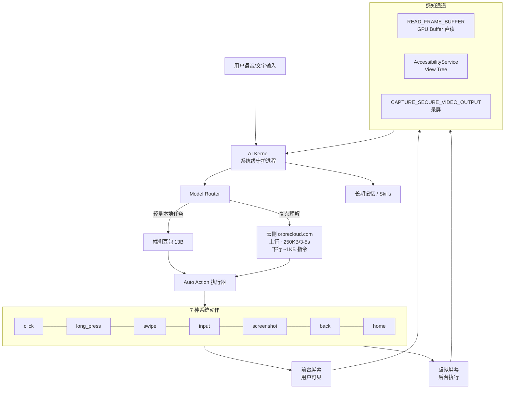
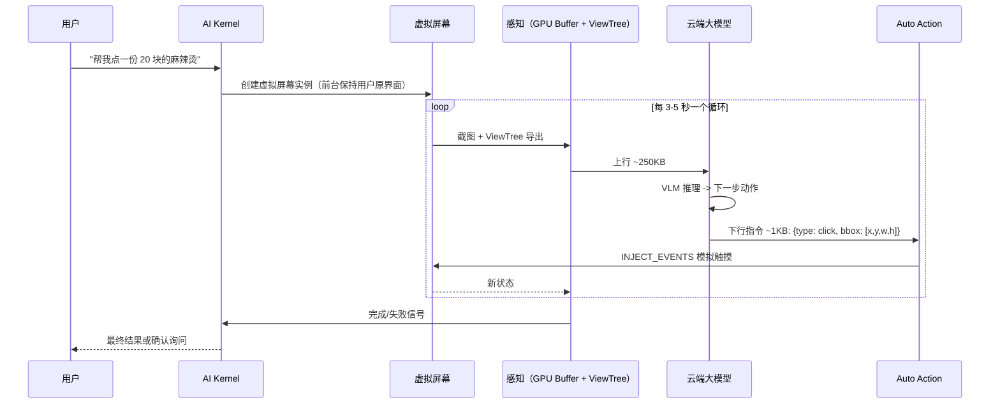

# 06 · 豆包手机 OS：原理 / 安全 / 交互

> 2025-12-01，字节跳动联手中兴子品牌努比亚发布 **努比亚 M153 豆包手机**（3499 元，首批 3 万台 24 小时售罄），被广泛认为是"全球首款系统级 AI Agent 手机"。上市一周后多个国民级 App 连夜封禁它，一度成为 2025 年末中国科技圈最戏剧性的事件 —— **技术上它代表了系统级 GUI Agent 的上限，商业/合规上它暴露了移动 Agent 面临的全部挑战**。[1][2][3]

## 6.1 产品与硬件栈

| 维度 | 值 |
| --- | --- |
| 首发时间 | 2025-12-01 |
| 厂商 | 中兴努比亚（ZTE 子品牌）× 字节跳动 |
| 型号 | 努比亚 M153 |
| 售价 | 3499 元起 |
| SoC | 高通骁龙 8 至尊版（8 Elite）|
| 内存/存储 | 12/16GB + 256/512GB/1TB |
| 屏幕 | 6.85" OLED 等 |
| 端侧模型 | 豆包 13B（端侧推理）|
| 云侧模型 | 字节豆包系列（orbrecloud.com）|
| 核心 Agent 进程 | `AI Kernel` + `Auto Action`（独立进程）|
| 核心卖点 | 端侧 + 云侧协同、跨 App 操控、系统级 Agent |

## 6.2 系统架构（Mermaid）

几个关键点：

- **前后台双屏**：前台屏给用户看，后台"虚拟屏幕"给 Agent 执行 —— 真正的后台 GUI Agent 不打扰用户 [1]。
- **端云协同**：上行（截图 / ViewTree）约 250KB/3-5s，下行（动作指令）约 1KB —— 云侧主要做"看 + 想"，端侧执行。[3]
- **系统级 AI Kernel**：不是一个 App，是系统守护进程。常规 Android 上没有同名进程。

## 6.3 四大高危权限（豆包手机独有）

这是豆包手机最刺激的地方：它不是靠 AccessibilityService 糊，而是申请了**常规 Android 应用拿不到的系统级权限**[1][3]。

| 权限 | 作用 | 风险等级 | 常规 Android 应用能拿到吗 |
| --- | --- | --- | --- |
| **AccessibilityService** | 读 View Tree、监听窗口事件、模拟点击 | 🟡 | ✅ 用户授权 |
| **INJECT_EVENTS** | 系统级注入按键和触摸事件 | 🔴 | ❌ 需系统签名 |
| **READ_FRAME_BUFFER** | 直接读 GPU FrameBuffer | 🔴 | ❌ 需系统签名 |
| **CAPTURE_SECURE_VIDEO_OUTPUT** | 录屏穿透安全标记（如银行 App 的 FLAG_SECURE）| 🔴🔴 | ❌ 需系统签名 |

意思是，**其他 App 为防作弊设置的 `FLAG_SECURE` 在豆包手机上失效**（银行、微信支付、券商的关键界面本来不允许被录屏/截屏）[3]。

为什么这是问题？因为这不再是 App 层面的 Agent，而是**系统级 Agent 穿透 App 隔离**。App 厂商对 Agent 的行为完全失控。

## 6.4 GUI Agent 演进三阶段

豆包手机是系统级 GUI Agent 的第一个量产尝试。把它放回历史 [3]：

| 阶段 | 代表 | 核心机制 | 局限 |
| --- | --- | --- | --- |
| 外挂框架 | Mind2Web / AppAgent / Auto-GPT 浏览器版 | LLM + DOM/HTML 文本 + 自己写的 playbook | 没有真手机 OS 权限；DOM 稀疏 |
| **模型原生** | UI-TARS（字节）、CogAgent（清华）、GPT-4V 系 | 多模态 VLM 端到端看截图出动作 | 普通 App 权限下执行困难 |
| **系统级** | 豆包手机、Honor YOYO、荣耀 MagicOS、鸿蒙 6 系统级 Agent | 系统 Kernel 直接调 GPU Buffer / INJECT_EVENTS / 虚拟屏 | 隐私 + App 风控 + 监管合规 |

模型侧，豆包用的是字节自研的 **UI-TARS**（end-to-end VLM，端到端看屏幕出动作）。UI-TARS 论文在 2025 年开源后成为系统级 Agent 的事实基座之一 [4]。

## 6.5 Auto Action 进程的 ReAct 循环

公开资料里最完整的是知乎/搜狐的技术拆解 [3]：

循环特征：

- 每一步都是"看 → 想 → 动"的 3-5 秒节拍
- 前台屏幕完全不动，用户甚至可以玩别的
- 错一步就错全链，所以有 fallback：模型置信低 → 询问用户 / 切回前台

## 6.6 交互问题（实战级 case）

媒体报道与用户测试暴露的问题 [1][2][3]：

| 问题 | 实例 | 根因 |
| --- | --- | --- |
| 焦点抢占 | 虚拟屏 + 真实屏争通知/铃声 | 进程调度冲突 |
| 误操作 | "订午饭" 误点到 98 元高价套餐 | VLM 看屏幕对齐错误 |
| 多步任务幻觉 | 订票下单后发现信息填错 | 长程幻觉 + 验证缺失 |
| App 风控反制 | 微信/淘宝/支付宝检测到自动化，直接封 | 风控 SDK 识别 INJECT_EVENTS 痕迹 |
| 支付环节不敢放手 | 最后一步必弹用户确认 | 合规要求 |
| 不同 App UI 版本 | 一更新 UI，Agent 脚本就废 | 没有稳定 API 约定 |

## 6.7 首周 App 封禁风波

2025-12-02 起，陆续被封禁的 App（公开报道汇总）[1][2]：

| App | 封禁形式 |
| --- | --- |
| 微信 | 直接不允许登录 / 风控弹窗 |
| 淘宝 | 拒绝支付 |
| 支付宝 | 高风险警告 + 限制登录 |
| 高德地图 | 部分功能不可用 |
| 美团/饿了么 | 下单风控 |
| 拼多多 | 部分风控 |
| 抖音（字节自家）| ✅ 正常 |
| 各银行 App | 拒绝登录（FLAG_SECURE 被穿透）|

**核心冲突**：App 厂商的安全责任 vs 系统 Agent 的能力。这不是技术问题，是"谁应承担风控义务"的商业/法律问题。

两种可能的和解路径：

1. **API 化**：App 主动对系统 Agent 暴露"可信 Intent"（类似 Android App Actions / iOS Shortcuts 升级），用 API 代替 GUI 注入。
2. **监管介入**：国家层面定义"AI Agent 操作权" —— 目前无定论。

## 6.8 对比表：主流移动/桌面 Agent 接入路径

| 产品 | 所在层 | 接入手段 | 合规 |
| --- | --- | --- | --- |
| **豆包手机** | 系统级 | INJECT_EVENTS + READ_FRAME_BUFFER + 虚拟屏 | 最强但最争议 |
| 鸿蒙 6 系统级 Agent | 系统级 | 鸿蒙原生 Intent + AbilityKit | 鸿蒙内生态 |
| 荣耀 YOYO / MagicOS | 系统级 | 部分系统权限 + 云模型 | 相对温和 |
| Google Assistant（Android 14+） | App 级（权限收紧）| Accessibility 受限 + App Actions | 最保守 |
| Samsung Bixby | 系统级 | 系统集成 | 韩国地区主导 |
| AutoGLM（智谱）| App 级 | ADB 调试 + VLM 视觉 | 需 ADB 开发者模式 |
| Apple Intelligence + App Intents | 系统级（API 优先）| App Intents 对接 | 生态封闭严控 |
| ChatGPT Operator / Browser Use | Web 级 | Playwright/Chrome 扩展 | 只操控浏览器 |
| Claude Computer Use | 桌面级 | 虚拟显示 + 鼠标键盘 API | 需自行沙盒 |

**趋势**：Apple / Google 走"API 优先"路线（安全但慢），中国厂商（字节/荣耀/鸿蒙）走"系统级权限 + VLM"路线（能力强但合规摩擦多）。豆包手机是后者的最激进代表。

## 6.9 安全问题的三层

### Layer 1：用户隐私

- FRAME_BUFFER 让 Agent 能看到一切屏幕内容（包括密码）
- 虚拟屏幕后台自动化 = 用户可能不知道 Agent 正在做什么
- `CAPTURE_SECURE_VIDEO_OUTPUT` 穿透银行 App 的 FLAG_SECURE

### Layer 2：App 生态对抗

- App 风控必须识别 INJECT_EVENTS —— 反过来 Agent 必须越来越像人
- 军备竞赛：注入 → 检测 → 反检测 → 硬件级防伪 → ...

### Layer 3：监管不确定性

- "我的 Agent 替我点外卖" 出错，责任在谁？
- App 有权拒绝 Agent 吗？（类似 robots.txt 但适用于 GUI）
- 涉及支付/医疗/教育时，Agent 行为的法律效力

## 6.10 真正值得学的技术点

剥开商业争议，豆包手机在工程上的创新值得记住：

1. **虚拟屏 + 前后台隔离**：别的 GUI Agent 最难的就是"被用户打断"，豆包直接另开一块屏，用户用不到后台。
2. **端云协同的数据契约**：上行 250KB（视觉）/ 下行 1KB（指令）—— 所有 VLM 应用应该照这个比例设计，重点在"云侧做语义理解 + 端侧执行"。
3. **系统进程化**：Agent 不再寄生在一个 App 里 —— 这是"AI 操作系统"形态的首次量产落地。
4. **7 种动作归一化**：click / long_press / swipe / input / screenshot / back / home —— 把 GUI 操作抽成 7 个原子动作，和 ChatGPT Operator / Claude Computer Use 的 API 表非常相似，**跨厂商可能统一**[5]。

## 6.11 未来看什么

| 方向 | 要关注的信号 |
| --- | --- |
| API 化 | Android/iOS 是否给 App 提供"Agent Intents" 标准 |
| 监管 | 中国 / 欧盟 / 美国 对自动化操作的法规 |
| 模型 | UI-TARS v2 / 更小更准的端侧 VLM |
| 竞争 | 荣耀 YOYO、鸿蒙 6、Apple Intelligence 是否跟进虚拟屏 |
| 开源 | `zai-org/Open-AutoGLM` 等项目能否跟上系统级体验 |

## 参考来源

访问日期：2026-04-18。

1. 《豆包手机的"生死劫"》. 腾讯新闻. https://view.inews.qq.com/a/20251208A07BTJ00
2. 《豆包手机遭微信/淘宝等 App 封禁：AI Agent 与 App 生态的正面冲突》. 网易科技. https://www.163.com/dy/article/KQI1CRTF05118O92.html
3. 《从豆包手机谈起：GUI 操控或许并非端侧智能的终局》. 搜狐科技. https://www.sohu.com/a/968588095_827544
4. 《UI-TARS：字节开源的端到端 GUI Agent 基座模型》. GitHub. https://github.com/bytedance/UI-TARS
5. zai-org/Open-AutoGLM Issue #36 技术讨论. https://github.com/zai-org/Open-AutoGLM/issues/36
6. 《Android 14 Accessibility 权限收紧说明》. Google Android Developers. https://developer.android.com/about/versions/14
7. Anthropic. *Claude Computer Use*. https://www.anthropic.com/news/3-5-models-and-computer-use
8. OpenAI. *Introducing Operator*. https://openai.com/index/introducing-operator/
