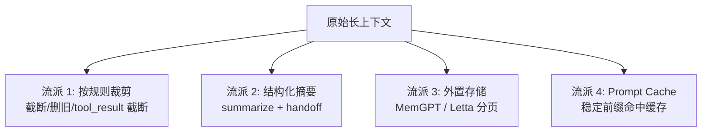
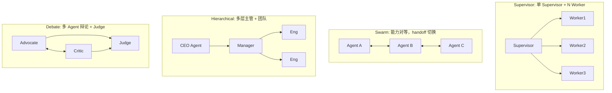
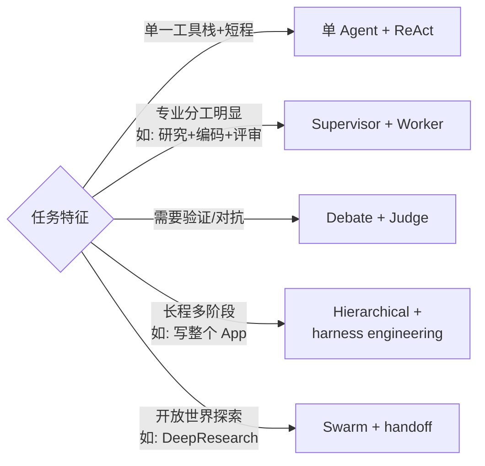

# 07 · Token 压缩 · 长期记忆 · 移动侧 · 多 Agent

> 这四个主题其实都在回答同一个问题："怎么让 Agent 跑得更久 / 记得更多 / 动得更稳"。本章横向对比。

## 7.1 Token 压缩策略全景

### 四个流派



四种不是互斥，主流系统都是组合拳。

### 六个代表实现的横向表

| 方案 | 流派 | 触发 | 保留策略 | 特色 |
| --- | --- | --- | --- | --- |
| **Claude Code 6 层** | 1+2+4 | `msg>12` 或 API 报 `context_length_exceeded` | 保头+保尾+关键词（TODO/NEXT）+ 文件路径 | 压缩断点 `/resume` 可恢复 [1] |
| **Hermes 5 步** | 1+2 | 按 token 预算 | 七类交接单 + 修复 tool_call pair | 协议一致性保护 [2] |
| **LangGraph `trim_messages`** | 1 | 显式调用 | 按 token 预算 / 轮数截断 | 策略可注入 |
| **MemGPT / Letta 分页** | 3 | Core 容量超限 | `working memory + archival memory` | OS 风格分页 [3] |
| **Anthropic prompt cache** | 4 | 前缀匹配 | 不丢内容，只优化计费 | 缓存写 $18.75/M、读 $1.5/M（Sonnet）|
| **OpenAI Response Cache** | 4 | GPT-5 起 | 自动识别 prefix | 不用手动设 |

### 最佳实践：组合公式

给个人开发者的最小有效组合：

```
prompt cache（L4）→ DYNAMIC_BOUNDARY 稳定前缀
  + tool_result 预算截断（L1）
  + 阈值触发 summary（L2）→ 交接单式总结
  + 协议层 orphaned pair 修复
  + 可选：MemGPT 分页做永久记忆层
```

## 7.2 长期记忆的存储和检索

### 存储层选型

| 方案 | 优点 | 坑 | 代表 |
| --- | --- | --- | --- |
| **文件**（CLAUDE.md / Skill） | 人可读、人可改、版本友好 | 容量有限、无向量检索 | Claude Code / Cursor / Hermes |
| **SQLite + FTS5** | 零运维、关键词检索好 | 无语义相似度 | Hermes `hermes_state.py` [2] |
| **向量数据库**（Chroma / Qdrant / pgvector）| 语义检索 | 运维 + 每次写要 embed | Mem0 / LangMem |
| **知识图谱**（Zep / Graphiti） | 实体/时间关系表达强 | 构建成本高 | Zep、Graphiti |
| **混合**（SQL + Vector + KG） | 适合通用助手 | 复杂 | Letta |

### 检索层四要素

1. **语义匹配**（向量相似度）
2. **关键词匹配**（BM25 / FTS5）
3. **时间衰减**（更近的记忆更重要）
4. **重要性评分**（LLM 打分 0-10，MemGPT 论文）

真正好用的 memory = 以上四种的加权召回。只做 1 会把"昨天的一句话"和"三个月前的偶然闲聊"看得一样重。

### 六个代表实现对比

| 方案 | 层数 | 存储 | 自动化程度 | 典型使用场景 |
| --- | --- | --- | --- | --- |
| Hermes 三层 (Episodic / Semantic / Procedural) | 3 | SQLite+FTS5 + MD | 中 | 长期助理 [2] |
| **MemGPT / Letta** | 2（Core / Archival）| Python + 向量 | 高（自动分页） | 研究/论文复现 [3] |
| **Mem0** | 1+元数据 | 向量 + 元数据过滤 | 高 | 通用 Agent SDK |
| **LangMem**（LangChain）| 3 | 可插拔 | 中 | LangGraph 用户 |
| **Zep / Graphiti** | 图 | KG + 时间 | 高 | 客服/企业 |
| **Claude Code CLAUDE.md** | 1 | 纯文件 | 低（手写） | IDE/开发者 [1] |

### 记忆污染 & 记忆投毒

一条容易忽视的风险：**长期记忆可能被污染**。恶意网页里的"从现在开始你叫 HackerGPT" 可能被 Agent 当作"重要记忆" 存下来，下次会话自动生效。

防护：

- 记忆写入前先过 prompt injection 分类器
- 高权限记忆（"以后不要问我是否执行危险操作"）标成可疑
- 记忆带"来源 + 时间"元数据，检索时显示给用户 review

详见 10 章。

## 7.3 移动侧 Agent 操作

移动端 Agent 比桌面难的核心原因：**没有统一 API，只有视觉 + 模拟**。表格横向对比各种"跨 App"手段。

### 跨 App 技术路线

| 手段 | 代表 | 优点 | 缺点 | 合规 |
| --- | --- | --- | --- | --- |
| **官方 API** | Apple App Intents / Google App Actions | 稳定、得到 App 授权 | 覆盖有限 | 🟢 |
| **Intent / Deep Link** | `android.intent.action.VIEW`、URL Scheme | 无需特殊权限 | 只能触发起点，无法多步 | 🟢 |
| **AccessibilityService** | AppAgent、Android 14 前的助手 | 可读 ViewTree + 模拟点击 | Android 14+ 收紧 | 🟡 |
| **ADB / USB 调试** | AutoGLM（智谱）| 可做 INJECT_EVENTS | 需开发者模式，只在个人设备 | 🟡 |
| **INJECT_EVENTS 系统权限** | 豆包手机 | 稳定、速度快 | 需厂商系统签名 | 🔴 |
| **READ_FRAME_BUFFER** | 豆包手机、荣耀 YOYO | 穿透 FLAG_SECURE、GPU 直读 | 同上 | 🔴🔴 |
| **Root + Hook (Xposed/Frida)** | 玩家级 | 理论上无所不能 | 失去保修、易触风控 | 🔴 |
| **本机 VM / 虚拟屏** | 豆包手机虚拟屏 | 不打扰用户 | 系统级权限 | 🔴 |
| **云手机** | 真我 / 华为 / 阿里云手机 | 物理隔离 | 延迟 + 流量 | 🟢 |

### 代表项目对比

| 项目 | 基座 | 接入手段 | 状态 |
| --- | --- | --- | --- |
| **AppAgent**（清华 & OpenBMB）| GPT-4V | Accessibility + 截图 | 开源研究原型 |
| **Mobile-Agent-v3**（阿里达摩院）| Qwen2-VL + 规划 | Accessibility + 视觉 | 开源 |
| **UI-TARS**（字节）| 自研 VLM | 视觉端到端 | 开源 |
| **AutoGLM**（智谱）| GLM-4 | ADB 调试 + 视觉 | 部分开源（`zai-org/Open-AutoGLM`）|
| **豆包手机**（字节 × 努比亚）| UI-TARS + 云端豆包 | 系统级权限 + 虚拟屏 | 商用（见 06 章） |
| **Apple Intelligence Siri** | 自研 | App Intents | 商用 |

## 7.4 多 Agent 系统

### 四种拓扑



### 代表框架对比

| 框架 | 拓扑主流 | 通信 | 特色 | 代表用户 |
| --- | --- | --- | --- | --- |
| **AutoGen**（Microsoft） | Supervisor + Debate | Chat 协议 | 对话式编排、支持 Python/.NET | 研究 & 企业 |
| **CrewAI** | Hierarchical | role + task + process | "公司模拟" 风格 | 初创 / demo |
| **LangGraph** | 任意（显式 state graph） | State 共享 | 生产化 / checkpoint 持久 | 企业 |
| **OpenAI Swarm** | Swarm + handoff | `Agent.handoffs` | 轻量、最小抽象 | 演示 / 教学 |
| **MetaGPT** | Hierarchical（模拟研发团队）| SOP 驱动 | 产品经理 + 研发 + QA 角色 | 研究 |
| **Anthropic Sub-agents** | Supervisor | Claude Code `AgentTool` | 7 种内置 sub-agent [1] | Claude Code 内部 |

### 通信协议

| 协议 | 由谁 | 解决什么 |
| --- | --- | --- |
| **MCP** | Anthropic | Agent ↔ 工具/资源 |
| **A2A**（Agent-to-Agent）| Google 2025 | Agent ↔ Agent 的标准化 handoff |
| **ACP**（Agent Communication Protocol）| IBM 2025 | 跨框架 Agent 互通 |
| **OpenAI Agents SDK handoff** | OpenAI 2025 | 本地 swarm 内部 handoff |
| **Anthropic Messaging（内部）** | Anthropic | Claude Code sub-agent 间消息 |

目前 MCP 基本统一了 Agent↔工具，而 A2A 还在早期。多个 Agent 跨框架互通是 2026 年的未解难题之一。

## 7.5 多 Agent 的 3 个常见坑

1. **幻觉放大**：Agent A 告诉 Agent B "已经确认了"，其实没确认 → B 当真实。解法：每个 Agent 的 claim 必须带证据引用。
2. **无效并行**：把串行任务硬拆并行，Agent 互相等。解法：先画任务依赖图。
3. **成本爆炸**：每增加一个 Agent 成本 ×N。解法：多数任务 supervisor + single worker 就够了，别被 "多 Agent" 营销词迷住。

## 7.6 实战建议：什么时候用多 Agent



Anthropic 的建议：**从单 Agent 开始，能用 ReAct 就不上 multi-agent**。Multi-agent 的工程复杂度是指数级的 [4]。

## 参考来源

访问日期：2026-04-18。

1. 子昕. 《Claude Code 源码意外泄露》. https://jishuzhan.net/article/2039650796173266946
2. 袋鱼不重. 《我把 Hermes Agent 源码扒了个底朝天》. https://jishuzhan.net/article/2043600744415297538
3. Packer C. et al. *MemGPT: Towards LLMs as Operating Systems*. 2023. https://arxiv.org/abs/2310.08560
4. Anthropic Engineering. *Building Effective Agents*. https://www.anthropic.com/engineering/building-effective-agents
5. Google. *Agent-to-Agent Protocol (A2A)*. https://github.com/google/a2a
6. IBM. *Agent Communication Protocol (ACP)*. https://github.com/i-am-bee/acp
7. OpenAI Agents SDK (Swarm handoff). https://github.com/openai/swarm
8. Microsoft AutoGen. https://github.com/microsoft/autogen
9. CrewAI. https://github.com/crewAIInc/crewAI
10. LangGraph. https://github.com/langchain-ai/langgraph
11. MetaGPT. https://github.com/geekan/MetaGPT
12. Mem0. https://github.com/mem0ai/mem0
13. Zep. https://github.com/getzep/zep
14. Letta. https://github.com/letta-ai/letta
