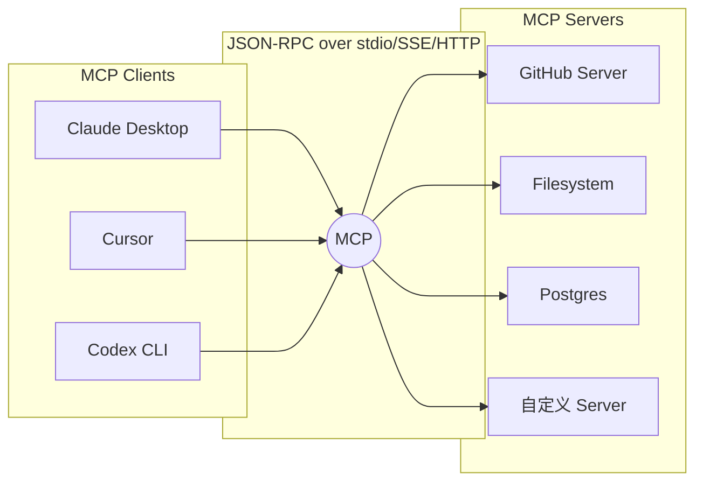

# 08 · AI 新概念补充（MCP / Benchmark / Obs / RAG 2.0 / CUA / UX / 推理）

> 2024–2026 在 Agent 领域涌现出一批新概念。这一章把你在别的文档里碰到"这词什么意思" 时需要的名词解释、关键出处、一句话价值判断集中在一起。

## 8.1 MCP（Model Context Protocol）深潜

### 一句话定义

> MCP 把 "LLM 接工具" 这件事抽象成 JSON-RPC 协议，让一个 MCP Server 能被多个 Client（Claude Desktop / Cursor / Windsurf / ChatGPT / Codex CLI 等）同时使用。[1]

由 Anthropic 2024-11 发起，2025 被整个行业接纳为事实标准。

### 架构图

### 三大能力

| 能力 | 作用 | 典型 |
| --- | --- | --- |
| **Tools** | 执行副作用 | `createIssue`, `sendEmail` |
| **Resources** | 提供只读数据 | 文件、数据库表、日志 |
| **Prompts** | 提供可参数化提示模板 | "写周报的模板" |

### 传输层

| 传输 | 用途 |
| --- | --- |
| stdio | 子进程通信（Claude Desktop / Cursor 主力） |
| SSE | 单向流 |
| Streamable HTTP | 2025 新增，替代旧 SSE |
| WebSocket | 较少用 |

### 用户同意模型 & 信任边界

MCP 规范规定：**每次工具调用前必须由用户明确同意**。Cursor / Claude Desktop 的弹窗机制就是这条规范的实现。理论上 MCP Server 是"零信任"对象，客户端必须做:

1. 调用前 schema 校验
2. Description 不能信其"自描述的安全性"
3. 工具中毒（tool poisoning）是真实威胁（见 10 章）

### MCP 生态

| 入口 | 作用 |
| --- | --- |
| `mcp.so` / `smithery.ai` / `glama.ai` | 社区索引 |
| 官方列表 `modelcontextprotocol/servers` | 官方参考实现 |
| Claude Desktop `~/Library/Application Support/Claude/claude_desktop_config.json` | 配置示例 |

## 8.2 A2A / ACP / Agent Handoff

| 协议 | 由谁 | 解决什么 |
| --- | --- | --- |
| **A2A**（Agent-to-Agent） | Google 2025 | 跨组织 Agent 互通 |
| **ACP**（Agent Communication Protocol） | IBM 2025 | 跨框架 Agent 协议 |
| **OpenAI Agents SDK handoff** | OpenAI 2025 | 单进程 swarm 内 handoff |

截至 2026-04，MCP 统一了"Agent↔工具"，但 Agent↔Agent 还在多标准并存阶段。

## 8.3 Computer-Using Agent (CUA)

把鼠标、键盘、屏幕当 API。2024 年下半年到 2026 Q1 密集发布：

| 产品 | 时间 | 做什么 | 形态 |
| --- | --- | --- | --- |
| **Anthropic Claude Computer Use** | 2024-10 | 截屏 + 鼠标键盘 API | 开发者 API |
| **OpenAI Operator / CUA** | 2025-01 | 浏览器 / 通用桌面操作 | 产品（ChatGPT 订阅） |
| **Microsoft CUWM** (Computer-Using World Model) | 2025 年末 | 通用 GUI 操作 | 研究 |
| **Monica Manus** | 2025-03 | "通用 Agent 工作台"，自带虚拟电脑 | 邀请制产品 |
| **UI-TARS**（字节）| 2025 | 端到端 GUI VLM 基座 | 开源 |
| **AutoGLM** | 2024-2025 | 桌面 + 移动 | 智谱 |
| **豆包手机** | 2025-12 | 系统级移动 Agent | 见 06 章 |

**桌面 vs 移动**：

| 维度 | 桌面 | 移动 |
| --- | --- | --- |
| UI 分辨率 | 高 | 低但屏小 |
| 权限 | 操作系统级相对宽容 | App 风控严、权限紧 |
| 速度 | 网络延迟可以容忍 | 用户容忍度低 |
| 成本 | 云端 VM 贵 | 端侧 13B 模型也能做 |
| 合规 | 较少争议 | 合规摩擦多（见 06）|

## 8.4 Agentic RAG / RAG 2.0

传统 RAG（2023）：Query → Retrieve → Stuff into prompt → Answer。问题是：检索一次定终身，召回差就完蛋。

Agentic RAG（2024+）：检索变成 Agent 循环里的一个 Tool，可迭代、可改写、可评分。

| 名字 | 核心创新 |
| --- | --- |
| **Self-RAG** | 生成过程中自己决定"要不要再查" [2] |
| **Corrective-RAG (CRAG)** | 检索质量打分 → 不够就重写 Query / 上网搜 |
| **HyDE** | 用 LLM 先生成一个假答案，再用假答案的向量去检索 |
| **Reranker** | Cohere / BGE-reranker 等二阶段重排 |
| **GraphRAG (MS)** | 预先抽实体 + 关系建图，查询时按社区走 |
| **Graphiti** | 带时间维度的图谱 RAG |
| **Late Chunking** | 用长上下文模型做 embedding，再切 chunk，保留全文语义 |

**和 CLAUDE.md / Skill 的边界**：CLAUDE.md 是"每次都附" 的小规约，RAG 是"按需召回"的大数据。前者稳定但小，后者大但有失败概率。两者互补，不互斥。

## 8.5 Observability 栈

2026 主流组合：

| 工具 | 特色 | 开源 |
| --- | --- | --- |
| **Langfuse** | 开源自托管、生产友好 | ✅ |
| **LangSmith**（LangChain）| 生态强 | 闭源 SaaS |
| **Arize Phoenix** | 开源 + 评估能力 | ✅ |
| **Helicone** | LLM 代理 + 观测 | ✅ |
| **OpenLLMetry** | OpenTelemetry GenAI 语义约定 | ✅ |

统一标准是 **OpenTelemetry GenAI semantic conventions**（2025 提出），定义了 `gen_ai.system`、`gen_ai.request.model`、`gen_ai.usage.prompt_tokens` 等属性。用它能换后端不换代码 [3]。

## 8.6 Benchmark 速查

| Benchmark | 关注 | 2026-04 SOTA 示意 |
| --- | --- | --- |
| **SWE-bench Verified** | GitHub 真实 bug 修复 | Claude Sonnet 4.5 驱动 agent 已 >70% |
| **OSWorld** | 桌面 GUI 任务 | UI-TARS / Computer Use 头部 |
| **WebArena / VisualWebArena** | 浏览器任务 | OpenAI Operator 类 |
| **GAIA** | 通用多步推理 | GPT-5 / Claude Opus 4.5 |
| **BrowseComp** | 深度浏览器研究 | OpenAI DeepResearch |
| **τ-bench** | 多轮对话 / 工具使用 | Claude / GPT 类 |
| **AgentBench** | 综合 Agent 能力 | 研究对比 |

**自建 Agent eval 的最小三步**：
1. 收集 20 条代表性任务 + 判定函数
2. LangSmith / Phoenix 跑 trace 记录工具调用
3. 看四根曲线：成功率 / 工具调用准确率 / 人类干预次数 / token 成本

## 8.7 Skills / SKILL.md 生态

Anthropic 2025 年推出 Skills，本质是"按需注入的 Markdown 工具"。对照表：

| 产品 | 机制 | 文件 |
| --- | --- | --- |
| **Anthropic Skills** | 条件匹配注入 | `~/.claude/skills/*/SKILL.md` |
| **Claude Code** | Skill 是 4 层扩展的第 2 层（见 03）[4] | 同上 |
| **WorkBuddy（腾讯）** | Skill 系统 + MCP | 企业自定义 |
| **Hermes** | Procedural memory 层 [5] | `~/.hermes/skills/` |
| **DeerFlow（字节）** | 研究流水线 skill | `deer-flow/skills/` |
| **Codex AGENTS.md** | 项目级规约 | `AGENTS.md` |

Skill 格式通用要素：`description`（触发条件）、正文（指令 + 工具说明）、可选的嵌入文件。形成事实标准，互转困难度较低。

## 8.8 推理 / 训练新概念

| 概念 | 解决什么 |
| --- | --- |
| **Prompt Caching**（Anthropic）| 稳定前缀收费降 10× |
| **KV-Cache Reuse** | 推理引擎（vLLM/SGLang/TGI）内部复用 attention KV |
| **Speculative Decoding** | 小模型猜 + 大模型验 → 解码速度 2-3× |
| **RLHF** | 人类偏好反馈（PPO）|
| **DPO**（Direct Preference Optimization）| 跳过 reward model，直接优化偏好 |
| **RLAIF** | 用 AI 反馈替代人类打分 |
| **RLVR**（Reinforcement Learning with Verifiable Rewards）| 有明确对错的任务（数学、代码测试）[6] |
| **GRPO**（DeepSeek R1）| Group Relative Policy Optimization，用组内相对分数替代 baseline |
| **Test-time Inference / Thinking** | o1 / R1 / Gemini Thinking / Claude Extended Thinking，把计算从训练时移到推理时 |

2026 趋势：**RLVR + GRPO + 测试时推理** 三件套，让开源模型追上闭源（DeepSeek R1 就是例子）。

## 8.9 Agent UX 模式

给 Agent 写 UI 时要掌握的 6 种模式：

| 模式 | 解决 | 典型 |
| --- | --- | --- |
| **Streaming** | 别等完整回复 | Claude Desktop token 逐字 |
| **Interrupt / Cancel** | 让用户随时停 | Claude Code Ctrl-C |
| **Confirmation** | 危险操作前问一下 | "Execute `rm -rf`? [y/N]" |
| **Long-running Task** | 跨时间维度任务 | Anthropic Managed Agents / GitHub Actions |
| **Human-in-the-Loop** | 关键点必须人介入 | LangGraph `interrupt()` |
| **Canvas / Artifacts** | 代码/文档双栏编辑 | Claude Artifacts / ChatGPT Canvas |

## 8.10 AI 硬件新入口（与教训）

| 产品 | 时间 | 结局 |
| --- | --- | --- |
| **Humane Ai Pin** | 2024-04 发售 | 2024-2025 口碑崩、公司被 HP 收购 |
| **Rabbit R1** | 2024-05 发售 | 早期被戳穿 "只是 Android 应用 + LAM demo" |
| **Limitless Pendant / Plaud Note** | 2024-2025 | 录音转摘要定位更小众 |
| **豆包手机** | 2025-12 | 首周 App 封禁风波（见 06） |
| **Apple Intelligence + iPhone 16/17** | 2024-2025 | API 优先、稳步推进 |
| **智能眼镜 Meta Ray-Ban / 雷鸟 / 华为** | 2024-2026 | 形态被看好 |

**共同教训**：专用 AI 硬件在手机没被颠覆前很难成立。豆包的聪明在于：它就是一部手机。

## 8.11 深度研究工具（DeepResearch）

2025 年新品类：不再是回答，而是"花 30 分钟做一份研究报告"。

| 产品 | 做法 |
| --- | --- |
| **OpenAI DeepResearch** | o-系列推理 + 浏览器 | 订阅 |
| **Perplexity Deep Research** | 多源检索 | 订阅 |
| **Google Gemini DeepResearch** | | 订阅 |
| **DeerFlow 2.0**（字节） | 开源多步研究框架 | 开源 |
| **manus / MiniMax Agent** | 虚拟电脑 + 多步 | 国内产品 |

技术范式：**Planner 分子任务 → Retriever 多工具检索 → Writer 合成长文 → Critic 自审**。本质是多 Agent + 长记忆 + 工具调用的集成应用。

## 参考来源

访问日期：2026-04-18。

1. Model Context Protocol 官方文档. https://modelcontextprotocol.io
2. Asai A. et al. *Self-RAG: Learning to Retrieve, Generate, and Critique through Self-Reflection*. 2023. https://arxiv.org/abs/2310.11511
3. OpenTelemetry GenAI Semantic Conventions. https://opentelemetry.io/docs/specs/semconv/gen-ai/
4. 子昕. 《Claude Code 源码意外泄露》. https://jishuzhan.net/article/2039650796173266946
5. 袋鱼不重. 《Hermes Agent 源码拆解》. https://jishuzhan.net/article/2043600744415297538
6. DeepSeek-R1 Tech Report. https://arxiv.org/abs/2501.12948
7. Anthropic Prompt Caching. https://www.anthropic.com/news/prompt-caching
8. SWE-bench. https://www.swebench.com/
9. OSWorld. https://os-world.github.io/
10. GAIA benchmark. https://arxiv.org/abs/2311.12983
11. Langfuse. https://langfuse.com/
12. Microsoft GraphRAG. https://github.com/microsoft/graphrag
13. Anthropic Claude Computer Use. https://www.anthropic.com/news/3-5-models-and-computer-use
14. OpenAI Operator. https://openai.com/index/introducing-operator/
