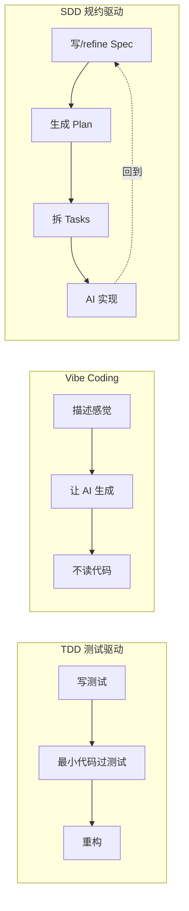
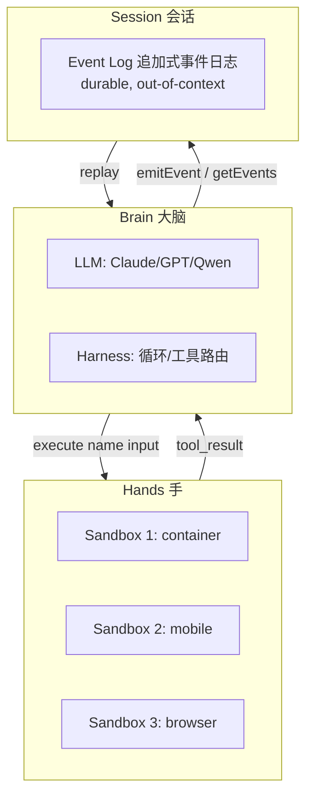
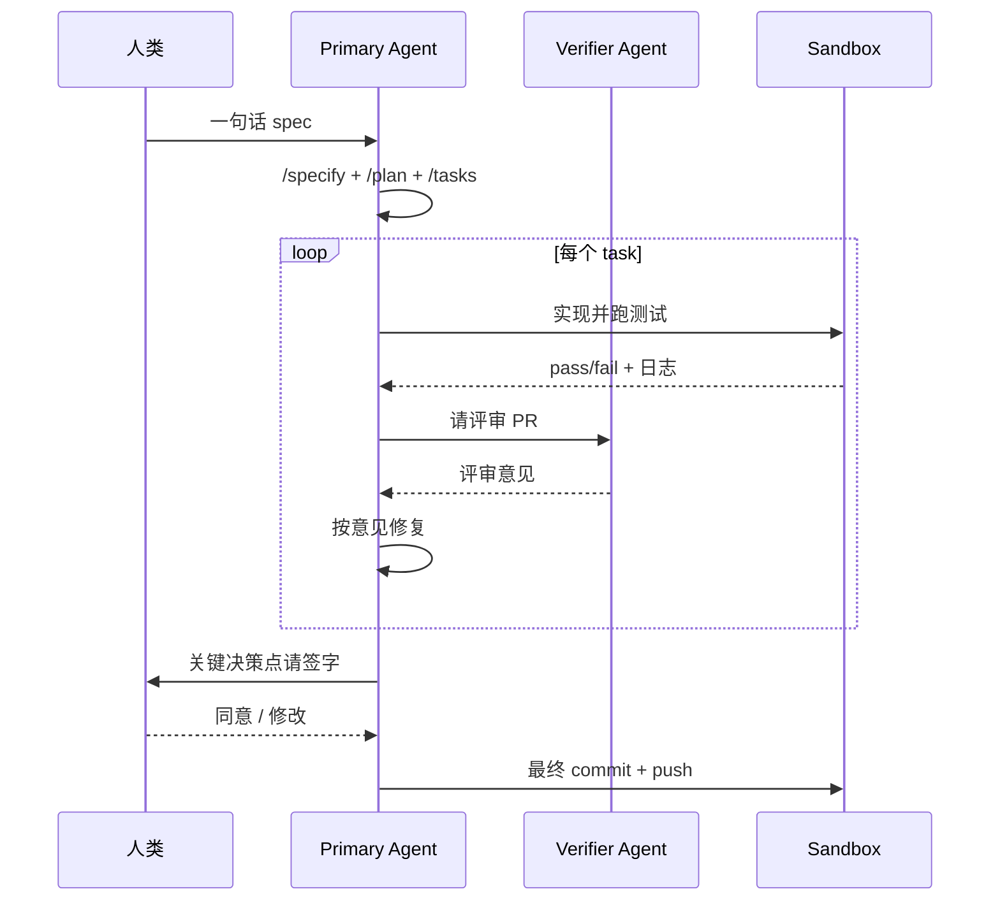
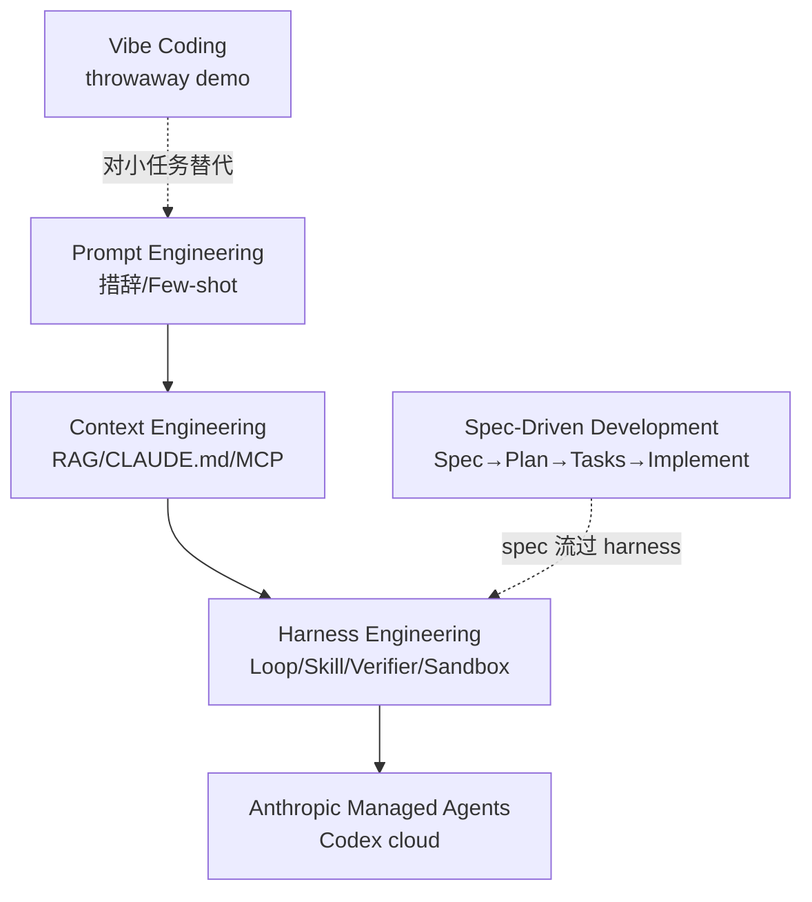

# 09 · AI 开发模式：SDD / Harness / Vibe / Context Engineering

> "我每天要和 AI 一起写代码" 的个人开发者，理应知道这条范式演进的主线。本章把 2023→2026 出现的几种主流 AI 编程范式摆在一起，说清它们解决什么、什么时候用、有什么局限。

## 9.1 三代工程范式演进

| 代际 | 核心动作 | 代表工具 | 优势 | 局限 |
| --- | --- | --- | --- | --- |
| **Prompt Engineering** | 调措辞、Few-shot、CoT | ChatGPT、早期 Copilot | 入门快 | 脆弱、不可复用 |
| **Context Engineering** | 投喂正确上下文 | RAG、CLAUDE.md、Cursor Rules、MCP | 减少幻觉、工程可维护 | 仍是单轮 / 半单轮 |
| **Harness Engineering** | 设计 Agent 运行的系统（Loop / Skill / Verifier / Sandbox） | Claude Code、Codex CLI、Managed Agents | 长程可靠 | 工程复杂度高 |

（来源：Rex Zhen《Harness Engineering: The Next Evolution》[1]、Anthropic《Scaling Managed Agents》[2]、OpenAI Lopopolo《Harness engineering》[3]）

**核心判断**：2026 年 red-hot 的是第三代 —— **模型会继续升级，你的 prompt 迟早过期，但你设计的 harness 一直在**。

## 9.2 SDD（Spec-Driven Development）

### 定义

> 把 Spec 当作第一公民，流程是 `Spec → Plan → Tasks → Implement`。代码从 spec 派生，而不是把 spec 写成注释丢在代码后面。[4]

### 和传统做法对比



### 代表工具

| 工具 | 特色 | 入口 |
| --- | --- | --- |
| **GitHub Spec Kit** | 开源 CLI，五条 slash：`/constitution`、`/specify`、`/plan`、`/tasks`、`/implement` | `uvx --from git+https://github.com/github/spec-kit.git specify init <name> --ai claude` [5] |
| **Amazon Kiro** | EARS 记号（Easy Approach to Requirements Syntax）+ AWS 生态 IDE | 商用 |
| **BMAD Method** | Breakthrough Method for Agile AI-driven Development | 开源方法论 |
| **通义灵码 Qoder** | 国内 Spec-first IDE | 阿里 |
| **Kilo Code** | 基于 Spec 的 agentic coding | 开源 |

Spec Kit 五条命令的输出流：

```mermaid
flowchart LR
    C[/constitution<br/>项目宪法] --> SP[/specify<br/>功能规约]
    SP --> PL[/plan<br/>技术方案]
    PL --> TK[/tasks<br/>拆 atomic tasks]
    TK --> IM[/implement<br/>Agent 逐 task 实现]
    IM --> V{验证}
    V -->|失败| TK
    V -->|成功| DONE[Done]
```

产物目录：

```
project/
├── .specify/
│   ├── constitution.md        # 项目宪法
│   └── memory/                # 长期记忆
├── specs/
│   └── 001-user-auth/
│       ├── spec.md            # 功能规约（WHAT）
│       ├── plan.md            # 技术方案（HOW）
│       └── tasks.md           # atomic tasks
├── AGENTS.md                  # 给任何 Agent 读的导航
├── ARCHITECTURE.md
└── docs/
    └── design-docs/
```

### SDD vs Vibe vs TDD 对比

| 维度 | SDD | Vibe Coding | TDD |
| --- | --- | --- | --- |
| 输入 | 用户需求（高层） | 需求的 vibe | 需求 + 测试 |
| 产物 | spec / plan / tasks / code | 跑得动的代码 | 测试 + 代码 |
| 质量保障 | Spec 可复核、Task 可回溯 | 跑起来看看 | 测试集 |
| 适用阶段 | 有明确目标，但可能是 greenfield 也可能是 brownfield | throwaway demo | 任何 |
| 失败模式 | Spec 写偏、Plan 变形 | 代码黑盒、不可维护 | 测试写错 = 代码写错 |
| AI 协作友好 | ✅ 强 | ✅ 强（但只限小项目） | 中 |

### 兼容的 AI 工具

Spec Kit 原生支持 Claude Code、Copilot、Cursor、Gemini CLI、Windsurf、Amazon Q、Codebuddy、Pi Coding Agent —— 同一 spec 可以换不同 Agent 执行。[5]

## 9.3 Harness Engineering

### 名字来源 & 定义

Anthropic 2025 年开始用 "harness" 这个词描述"Agent 运行的系统"（不是模型本身）[2]。"Harness" 原义是马具 —— 模型是马，harness 是车。OpenAI 2026 年 2 月 Lopopolo 写了同名文章从 Codex 团队角度讲同一范式 [3]。

### 三层解耦：brain / hands / session

Anthropic Managed Agents 把 Agent 拆成三件 [2]：



关键 API：

| 接口 | 作用 |
| --- | --- |
| `execute(name, input) → string` | 大脑调手 |
| `provision({resources})` | 初始化新 sandbox |
| `wake(sessionId)` | 崩溃后重启 harness |
| `getSession(id)` / `getEvents()` | 会话回放 |
| `emitEvent(id, event)` | 持久化一条事件 |

**Anthropic 的核心心得**[2]：

> Decoupling the brain from the hands means the container becomes cattle. If the container died, the harness caught the failure as a tool-call error and passed it back to Claude. We no longer had to nurse failed containers back to health.

（容器是"牲畜"不是"宠物"，挂了就 kill -9，别去抢救。）

### 为什么 Session 不是 Claude Context Window

传统做法是压缩 → 写进 context。问题是压缩动作不可逆，未来某轮可能需要被压掉的那段。

Managed Agents 把 session 做成**可回放的事件日志**，存在 context window 之外。Claude 可以用 `getEvents()` 切片访问，不需要"永远记得所有东西"。[2]

### OpenAI Codex 团队的案例

5 个月 0 行人手写代码，全由 Codex（GPT-5）生成约 100 万行 [3]。人类工作 =

1. 定义意图
2. 设计环境（Dockerfile / AGENTS.md / 测试 harness）
3. 写 Verifier（自动化测试 / review agent）

引入 "**Ralph Wiggum Loop**"：让 Codex 一直试，直到所有 reviewer agent 满意 —— 命名来自辛普森里那个一根筋的角色。

### Harness 内部的基本单元

```
Skill executes → produces output → verifier judges → loop back or advance
```

Orchestrator 管状态，超 N 轮无进展升级到人类。

### Harness Engineering 的 4 个关键原则

1. **Agent-readable codebase**：代码库对 Agent 友好（清晰命名、完整 README、`AGENTS.md` 导航、长函数名好过短缩写）[3]
2. **架构不变量 > 微管实现**：定义"这层永远不能直接调数据库"这类约束，而不是规定"用哪个库"
3. **吞吐量改变合并哲学**：PR 短命、flaky test 自动重跑不阻塞（因为有 20 个 PR 在排队）
4. **人类做 QA，不做编码**：review / 关键决策签字，实现交给 Agent

## 9.4 Vibe Coding

### 起源

Andrej Karpathy 在 2025-02 推特上造词 "vibe coding"[6]：

> There's a new kind of coding I call "vibe coding", where you fully give in to the vibes, embrace exponentials, and forget that the code even exists... I just talk to Composer with SuperWhisper so I barely even touch the keyboard.

### 一句话定义

> 完全靠感觉、AI 生成、不读代码。[6]

### 适用场景

- Throwaway demo / 周末黑客项目
- 原型探索
- 非关键业务的小脚本

### 不适用

- 生产业务代码
- 需要长期维护的项目
- 合规敏感场景（金融/医疗/安全）

### 现实情况

2025 下半年各家 Agent 的"Agent Mode" / "Composer" / "Background Agent" 把 vibe coding 变得可行，但这也造成了 OpenClaw 式的安全事故（见 05 章）。**Vibe + Spec** 的混合姿势在 2026 年更受欢迎：
- 探索阶段 vibe
- 沉淀到生产前补 spec + verifier

## 9.5 Context Engineering 深入

### 上下文元素清单

| 元素 | 静态/动态 | Cache 友好度 |
| --- | --- | --- |
| System Prompt | 静态 | ✅ |
| Tool Description | 静态（工具启动时） | ✅ |
| 规约文件（CLAUDE.md / AGENTS.md / `.cursor/rules`） | 半静态 | ✅ |
| MCP servers 列表 | 半静态 | ✅ |
| 环境快照（git 分支 / commit / diff / cwd） | 动态 | ❌ |
| 长期记忆（memdir） | 动态（按需注入） | ⚠️ |
| RAG retrieval | 动态 | ❌ |
| 用户消息 + 历史 | 动态 | ❌ |

### 失败模式 & 修复

| 失败模式 | 症状 | 修复 |
| --- | --- | --- |
| Context pollution | 策略被带偏 | 子 Agent 隔离上下文 / worktree |
| Lost-in-the-middle | 中间指令被忽略 | 头尾保护 + 结构化摘要 |
| Prompt cache miss | 成本爆炸 | `DYNAMIC_BOUNDARY` 分段 + 稳定工具顺序 |
| Tool hallucination | 调用不存在的工具 | `check_fn` / ToolSearchTool 延迟暴露 |
| Orphan tool_result | 压缩后协议非法 | 专门修复 pair（Hermes 做法） |

### Context Engineering 的 6 原则（Anthropic）

来自 Anthropic 2025-10 的《Effective context engineering for AI agents》[7]：

1. **Prompt is the new code** —— 把 prompt 当代码一样版本化
2. **Tool design is context design** —— 工具 schema 就是上下文的一部分
3. **Retrieve just-in-time, not up-front** —— 按需召回，不要一锅端
4. **Compact with summaries, not silence** —— 压缩要生成交接单，不要静默丢弃
5. **Persist across sessions** —— 关键决策必须持久化
6. **Observe everything** —— 全 trace 才知道 context 长什么样

## 9.6 典型 Agentic Coding Workflow



## 9.7 给个人学习者的实操建议

| 项目规模 | 推荐组合 | 为什么 |
| --- | --- | --- |
| 小 demo (< 500 行) | Vibe + Claude Code | 成本低，不需要 spec |
| 小项目 (< 5000 行) | Spec Kit + Claude Code，从 greenfield 开始 | 建立习惯 |
| 中大型 (5000+ 行) | Harness = Claude Code 作 brain，自己设计 Verifier skill 与 sandbox | 质量守门 |
| 生产系统 | Managed Agents / Codex cloud，PR 级 verifier | 异步长程 |

### 评估维度

- **任务成功率**（独立判定函数）
- **工具调用正确率**
- **token 成本** / 每任务
- **人类干预次数** / 每任务 —— 这是长期优化的关键指标，它降下来比任何其他指标都难

## 9.8 一张总结图：四种范式的边界



## 参考来源

访问日期：2026-04-18。

1. Rex Zhen. *Harness Engineering: The Next Evolution of AI Engineering*. dev.to 2026-04-08. https://dev.to/rex_zhen_a9a8400ee9f22e98/harness-engineering-the-next-evolution-of-ai-engineering-3ji7
2. Anthropic Engineering. *Scaling Managed Agents: Decoupling the brain from the hands*. 2026-04. https://www.anthropic.com/engineering/managed-agents
3. Lopopolo R. *Harness engineering: using Codex in an agent-first world*. OpenAI 2026-02-11. https://openai.com/index/harness-engineering/
4. Product Builder. *Spec-Driven Development 2026 Guide*. https://productbuilder.net/learn/spec-driven-development
5. GitHub Spec Kit. https://github.com/github/spec-kit / https://github.github.com/spec-kit/installation.html
6. Andrej Karpathy. *vibe coding* tweet. 2025-02. https://x.com/karpathy/status/1886192184808149383
7. Anthropic Engineering. *Effective context engineering for AI agents*. https://www.anthropic.com/engineering/effective-context-engineering-for-ai-agents
8. Augment Code. *Best Spec-Driven Development Tools*. https://augmentcode.com/tools/best-spec-driven-development-tools
9. Anthropic Engineering. *Effective harnesses for long-running agents*. https://www.anthropic.com/engineering/effective-harnesses-for-long-running-agents
10. Anthropic Engineering. *Harness design for long-running apps*. https://www.anthropic.com/engineering/harness-design-long-running-apps
