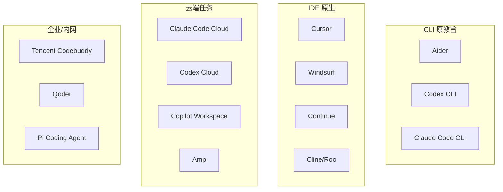

# 11 · Coding Agent 军备竞赛横向对比

> 2025–2026 是 "Coding Agent 军备竞赛年"：Anthropic Claude Code 从 CLI 长成 IDE + 云端三形态、Cursor 估值破百亿、OpenAI Codex CLI 回归、Microsoft Copilot Workspace 转 agentic、国内腾讯 Codebuddy / 阿里 Qoder / 字节 TRAE 同台登场。选型焦虑从"用不用 AI 写代码" 变成 "用哪个 Coding Agent"。本章横向对比。

## 11.1 全产品对比大表

| 产品 | 架构 | 模型 | 上下文策略 | MCP | Skill/Sub-agent | 计费 | 开源度 | 定位 |
| --- | --- | --- | --- | --- | --- | --- | --- | --- |
| **Claude Code** | CLI + IDE 插件 + 远程 | Claude 4.5/5 系列 | `CLAUDE.md` + 6 层压缩 + DYNAMIC_BOUNDARY | ✅ | ✅ Skill + 7 种 sub-agent | 订阅 + API | 闭源（有泄漏） | 开发者日常 CLI 首选 |
| **Cursor** | IDE 原生（VS Code fork） | Claude/GPT/Gemini 任选 | `.cursor/rules/*.mdc` + Composer | ✅ | ❌ 但可 `.cursorrules` | 订阅 | 闭源 | IDE 王者 |
| **OpenAI Codex CLI** | CLI + cloud | GPT-5 Codex 系列 | `AGENTS.md` + harness | ✅ | Codex cloud tasks | Plus/Pro 订阅 + API | ✅ CLI 开源 | 终端原教旨 |
| **Windsurf**（Codeium） | IDE（自研编辑器） | 多模型 | `.windsurfrules` + Cascade | ✅ | Flows | 订阅 | 闭源 | 老牌 Copilot 挑战者 |
| **Aider** | CLI | 任意（OpenAI/Anthropic/Ollama） | Repo map（AST 提取 signature）+ git | ✅ | ❌ | 按 token | ✅ MIT | 终端极简主义 |
| **Cline** | VS Code 扩展 | 任意 + Ollama | `.clinerules` + 工具循环 | ✅ | ✅ 简单 | 按 token | ✅ Apache | 开源派首选 |
| **Roo Code**（Cline fork） | VS Code 扩展 | 多模型 | 多 mode（Code/Architect/Debug） | ✅ | Modes | 按 token | ✅ | 强分角色 |
| **Amp**（Sourcegraph） | CLI + Web | Claude + GPT | Thread + Oracle | ✅ | Subagents | 订阅 | 闭源 | 代码搜索集成 |
| **Continue** | VS Code + JetBrains | 任意 + 本地 | `config.json` + rules | ✅ | ✅ Slash | 按 token | ✅ Apache | 可插拔定制 |
| **Pi Coding Agent**（InflectionAI） | IDE | 自研 | SDD | ✅ | Skill | 订阅 | 闭源 | Spec-first |
| **Copilot Workspace**（GitHub） | Web IDE | GPT 系列 | Task/Plan/Implement 三步 | 部分 | Tasks | GH Copilot 订阅 | 闭源 | Issue → PR 自动化 |
| **Tencent Codebuddy** | IDE + CLI | 混元 / Claude | 内部规约 + MCP | ✅ | Skills | 企业商用 | 闭源 | 国内合规首选 |

## 11.1b 产品形态分布



## 11.2 四个代表架构深拆

### Claude Code：harness 范式

**核心数字（来自泄漏源码）**：29 子系统、42 工具、184 工具文件、6 层压缩、3 级权限、4 层扩展、100+ 命令 [1]。

最独特点：

- `DYNAMIC_BOUNDARY` 把 system prompt 切成可缓存静态段 + 动态段，工具顺序固定优先 prompt cache
- 42 个工具**延迟暴露**，不是启动全给（ToolSearchTool 模式在早期版本已实现）
- 7 种内置 sub-agent（codeGuide / explore / generalPurpose / plan / verification 等），可并行工作在不同 Git worktree
- `compact_boundary` 作为 JSONL 特殊行，`/resume` 向前扫到这里就停

### Cursor：IDE 原生体验

**核心亮点**：

- **Composer + Background Agent** 两级：Composer 做眼下任务（30 分钟内），Background Agent 跑长程任务（PR 级）
- **`.cursor/rules/*.mdc`** 替代 `.cursorrules`，支持 glob 匹配特定文件类型或路径
- **Plugins 系统**（2025 末引入），MCP 一等公民
- **Diff 视角**：用户看到的永远是 diff，不是 "AI 改了什么文件"
- **Tab 补全 + Cmd-K** 的双模式：补全时 AI 看项目全图（fast index）

### Codex CLI：agent-first 终端

OpenAI 2026-02 Lopopolo 发布的 *Harness Engineering* [2] 的核心：

- **AGENTS.md**：项目级导航文件，被 Codex 优先读取（和 Claude CLAUDE.md 对等）
- **Ralph Wiggum Loop**：一直执行直到所有 reviewer agent 满意
- **GPT-5 Codex 系列**：在 SWE-bench Verified 2026-03 数据 ~74.9%（公开数据浮动）
- **Codex cloud**：异步 PR 级任务，和 Anthropic Managed Agents 类似定位

### Aider：极简主义样本

**Repo Map 算法**（这是 Aider 的灵魂）：

1. 用 Tree-sitter 对仓库所有代码抽取 symbol signature（class / function / import）
2. 按图论算法（PageRank 变体）给每个 symbol 打分
3. 按 token 预算选前 N 个塞给模型作上下文
4. 模型只看到"签名地图"，需要完整源码再要求 Aider 给

这样小模型也能"看到"大 repo。对比：Claude Code 靠 CLAUDE.md + FileRead 按需读取，思路不同但都能避免一锅端。

## 11.3 上下文工程策略对比

| 产品 | 规约文件 | 注入时机 | 优先级 | Cache 友好 |
| --- | --- | --- | --- | --- |
| Claude Code | `CLAUDE.md` (4K / 12K 总) | 每轮 system prompt 后段 | 覆盖链（根→子） | ✅ |
| Cursor | `.cursor/rules/*.mdc` | glob 匹配时注入 | 按 glob 精度 | ✅ |
| Windsurf | `.windsurfrules` | system prompt | 单一 | ✅ |
| Aider | `.aider.conf.yml` + repo map | 启动时构建 | 配置文件 | ⚠️（动态 map） |
| Codex CLI | `AGENTS.md` | system prompt | 项目根优先 | ✅ |
| Cline | `.clinerules` | system prompt | 单一 | ✅ |
| Continue | `config.json` rules | 按上下文 | 可编程 | ⚠️ |

**共识**：项目根的 Markdown 规约文件已成事实标准。命名虽然不统一（CLAUDE.md / AGENTS.md / `.cursor/rules`），但功能同构，内容互转成本低。

## 11.4 Skill / Subagent 生态

截至 2026-04，Skill 互转状况 [3]：

| 源 | 目标 | 迁移难度 |
| --- | --- | --- |
| Anthropic `SKILL.md` | Claude Code | ✅ 原生 |
| Anthropic `SKILL.md` | Cursor `.cursor/rules/*.mdc` | 小改：移除 `description` 头，用 glob |
| Claude Code Skill | Hermes Procedural | 中：格式要翻译为 python Skill |
| Codex AGENTS.md section | Claude CLAUDE.md | ✅ 几乎直接复制 |
| Cursor rule | Claude CLAUDE.md | ✅ 合并时拼接 |
| WorkBuddy Skill | Claude Skill | 可（社区工具 `jnMetaCode/agency-agents-zh`） |
| DeerFlow Skill | Claude Skill | 中 |

**趋势**：Skill 不会出现 ISO 标准，但会像 CLAUDE.md ≈ AGENTS.md 一样形成事实共识。

## 11.5 SWE-bench Verified 分数时间线（示意）

基于 swebench.com 公开数据（数字是示意量级，具体分数经常变动）：

| 时间 | 产品 / Agent | SWE-bench Verified 分数 |
| --- | --- | --- |
| 2024-08 | SWE-agent + GPT-4 | ~12% |
| 2024-10 | Claude 3.5 Sonnet + Agentless | ~30% |
| 2025-01 | Devin | ~40% |
| 2025-06 | Claude Sonnet 4 + Claude Code | ~55% |
| 2025-10 | Claude Sonnet 4.5 + Claude Code | ~65% |
| 2026-02 | GPT-5 Codex | ~70%+ |
| 2026-04 | Claude Sonnet/Opus 4.5 系 + 优化 harness | 70%+ |

**观察**：分数在两年里从 12% 爬到 70%+，但 bench 本身也在"失真"（很多真实 bug 有多种解，bench 的自动判定函数可能宽/紧）。**不要只看一个数**。

## 11.6 场景 → 推荐

| 场景 | 推荐 | 理由 |
| --- | --- | --- |
| Greenfield 小项目 | Claude Code + Spec Kit | 从规约开始，Agent 一路到底 |
| 大型 monorepo 日常 | Cursor / Windsurf | IDE 集成 + 半自动 |
| 终端原教旨 / 老 Unix 党 | Aider / Codex CLI | 极简、无 IDE 依赖 |
| 长程自主 PR 级 | Anthropic Managed Agents / Devin / Codex cloud / Amp | 异步、带 verifier |
| 本地离线 | Cline + Ollama | 隐私、0 成本 |
| 国内合规 | 腾讯 Codebuddy / 阿里 Qoder | 内部审计 |
| 学生 / 低预算 | Aider + DeepSeek API | 单价最低 |
| MacOS 深度集成 | Claude Code + Raycast / Alfred 扩展 | 工作流友好 |
| 团队协作 | Copilot Workspace + GitHub PR | 集成已有流程 |

## 11.7 选型三问

如果你必须三秒回答：

1. **你写什么量级代码？** 小项目 → Claude Code / Aider；大项目 → Cursor；PR 级 → Codex cloud / Managed Agents。
2. **你有多少 IDE 迁移成本？** 能换 IDE → Cursor/Windsurf；不能 → Cline/Continue（做 VS Code 扩展）。
3. **你在意开源还是在意效果？** 极致效果 → Claude Code（闭源）；开源可控 → Aider/Cline/Continue。

## 11.8 互操作：一个 AGENTS.md 走天下？

趋势是：同一个项目放**多个规约文件**（兼容多家 Agent）。自动同步的社区工具开始出现，比如 `jnMetaCode/agency-agents-zh` 尝试把 AGENTS.md / CLAUDE.md / `.cursor/rules` 互相同步 [3]。

最低限度建议：

```
project/
├── AGENTS.md          # 通用：项目地图、约束、架构不变量
├── CLAUDE.md -> AGENTS.md   # 软链接或同步脚本
├── .cursor/rules/
│   └── 000-base.mdc    # 从 AGENTS.md 生成
└── .windsurfrules -> AGENTS.md
```

## 11.9 个人订阅性价比（2026-04 市价）

| 产品 | 月费 | 对应能力 |
| --- | --- | --- |
| ChatGPT Plus + Codex | $20 | Plus 级别的 Codex 用量 |
| Claude Pro + Claude Code | $20 + code usage | Sonnet / Opus 按量 |
| Cursor Pro | $20 | 多模型切换 |
| Windsurf Pro | $15-20 | IDE |
| GitHub Copilot Pro | $10 | Copilot + Workspace 基础 |

实际月支出对重度用户：$50-150（多订阅 + API 溢出）。Haiku 跑小事 + Sonnet 跑大事的混合策略可省 50%（见 02/03 章）。

## 参考来源

访问日期：2026-04-18。

1. 子昕. 《Claude Code 源码意外泄露》. https://jishuzhan.net/article/2039650796173266946
2. Lopopolo R. *Harness engineering: using Codex in an agent-first world*. https://openai.com/index/harness-engineering/
3. jnMetaCode/agency-agents-zh. https://github.com/jnMetaCode/agency-agents-zh （Agent 规约文件互转）
4. SWE-bench Verified Leaderboard. https://www.swebench.com/
5. Cursor Docs. https://docs.cursor.com
6. Aider 仓库. https://github.com/Aider-AI/aider
7. Cline 仓库. https://github.com/cline/cline
8. Roo Code 仓库. https://github.com/RooVetGit/Roo-Code
9. Continue 仓库. https://github.com/continuedev/continue
10. Sourcegraph Amp. https://ampcode.com/
11. Anthropic Engineering. *Scaling Managed Agents*. https://www.anthropic.com/engineering/managed-agents
12. GitHub Copilot Workspace. https://githubnext.com/projects/copilot-workspace/
