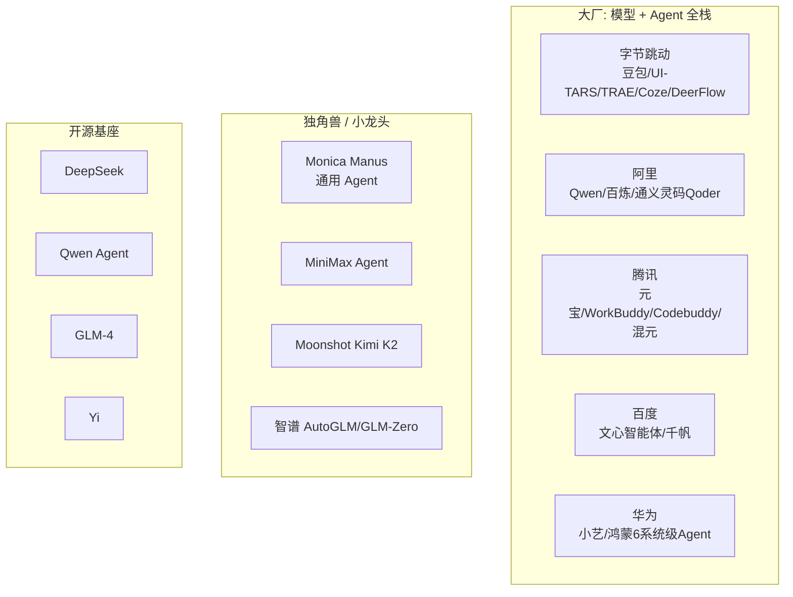

# 12 · 中国 Agent 生态全景

> 2024–2026 的中国 AI 厂商有一个共同动作：**从"做模型" 切到"做 Agent"**。因为模型差距开始收敛（Qwen/GLM/DeepSeek 已经追上），而应用层（Agent）才是最后能差异化的地方。本章盘点主要玩家、标志性产品、技术路线、以及和海外头部的对标关系。

## 12.1 玩家象限

## 12.2 标志性产品技术剖析

| 产品 | 定位 | 技术亮点 | 模型底座 | 可用性 |
| --- | --- | --- | --- | --- |
| **Manus**（Monica 出品） | 通用 Agent 工作台 | 虚拟电脑 + 多工作流 + task tree | Claude + 自研 | 邀请制 [1] |
| **Kimi K2**（Moonshot） | 1T 参数 Agentic 模型 | MuonClip 训练、原生工具调用、MoE 激活 32B | 自研 MoE | 开源 [2] |
| **AutoGLM / Open-AutoGLM**（智谱） | 移动/桌面 GUI Agent | ADB + 视觉 + 系统级接入 | GLM-4 | 部分开源 [3] |
| **DeerFlow 2.0**（字节） | 深度研究框架 | 多步研究流水线、Skill 系统 | 多模型适配 | 开源 [4] |
| **Coze**（字节） | Agent 无代码平台 | 工作流 + 插件市场 | 豆包 / GPT | 商用 |
| **UI-TARS**（字节） | GUI 基座模型 | 端到端视觉动作 VLM | 自研 VLM | 开源 [5] |
| **TRAE**（字节） | IDE/CLI Agent | SOLO 模式 | Claude / 豆包 | 商用 |
| **WorkBuddy**（腾讯） | 办公 Agent 平台 | Skill 系统 + MCP | 混元 / 外部 | 企业 |
| **Codebuddy**（腾讯） | Coding Agent CLI | MCP + 内部规约 | 混元 / Claude | 商用 |
| **通义灵码 Qoder**（阿里） | Spec-first IDE | Spec-Driven（`spec.md`→`plan.md`→`tasks.md`）| Qwen 系列 | 公测 |
| **百炼**（阿里） | Agent 开发平台 | Bailian 平台 + 工作流 | Qwen 系列 | 云服务 |
| **豆包手机**（字节+中兴） | 系统级移动 Agent | 见 06 章 | 豆包 + UI-TARS | 工程机 |

## 12.3 技术路线对比

国内厂商在 GUI / 移动 Agent 领域的三条技术路线：

| 路线 | 代表 | 核心能力 | 优点 | 缺点 |
| --- | --- | --- | --- | --- |
| **视觉派** | UI-TARS、AutoGLM、豆包手机 | 端到端 VLM 看屏幕出动作 | 不依赖 App 合作；跨平台 | 推理成本高、慢；错一帧全错 |
| **文本派** | Kimi K2、DeepSeek Agent | 原生 tool calling，纯 API 编排 | 成本低、速度快 | 依赖 App 提供 API |
| **混合派** | Manus、DeerFlow、Coze | 工具 + 视觉 + 工作流 | 灵活 | 复杂度高 |

**中美路线差异**：

| 方面 | 美国 | 中国 |
| --- | --- | --- |
| 模型底座 | 闭源大模型领先（Claude、GPT-5） | MoE 开源领先（DeepSeek、Kimi K2） |
| 推理优化 | 云侧算力堆 | 端侧 + 混合 |
| GUI 侧 | API 优先（Apple Intelligence） | 系统权限优先（豆包） |
| 开源 | 头部基本闭源 | DeepSeek/Qwen/GLM 开源 |

## 12.4 Kimi K2 深潜

Moonshot AI 2025-07 开源的 K2 是中国 Agentic 模型的代表 [2]：

- **MoE 1T 总参数，激活约 32B**
- **MuonClip 训练算法**：对 Muon Optimizer + 混合 FP8 训练的改进，训练成本显著降
- **原生工具调用**：训练阶段就用大量 tool calling 样本，SFT+RLVR
- **Agentic benchmark** 在 SWE-bench / GAIA / τ-bench 上和闭源头部接近

对中国开源基座的意义：**证明了不走闭源路线也能做出一流 Agent 模型**。

## 12.5 Manus 深潜

Monica 2025-03 发布的 Manus 是"中国通用 Agent"的标志性产品 [1]：

- 架构上是"Agent + 虚拟电脑 + 多工作流"，类似 Devin 但面向 C 端
- 前端呈现 task tree：任务被拆成子节点，每个节点可以独立完成
- 底座主要是 Claude（外加自研），海外曾因 "套皮" 争议
- 邀请制 beta，实际效果在国内视频演示里被高度认可

**争议与反思**：Manus 代表了一种"应用层创新优先" 的中国打法 —— 不纠结底座，优先把产品打磨到可用。长期看取决于能否沉淀自己的 harness 和 verifier。

## 12.6 AutoGLM / Open-AutoGLM 深潜

智谱 AutoGLM 是"移动 GUI Agent"的国内开源代表 [3]：

- **Open-AutoGLM** 在 `zai-org/Open-AutoGLM` 开源
- 技术路线：GLM-4 + 视觉 + ADB 桥接（桌面 Android 模拟器或真机）
- 支持 Web Agent（浏览器内）+ Phone Agent（ADB 控真机）
- Issue #36 详细讨论了系统级 vs ADB 方案的取舍

和豆包手机差别：豆包是系统级（INJECT_EVENTS），AutoGLM 是开发者模式 ADB，**面向开发者友好，合规风险低**。

## 12.7 DeerFlow 深潜

字节开源的 DeerFlow（`bytedance/deer-flow`）是"深度研究 Agent" 的代表 [4]：

- 多步研究流水线（研究规划 → 检索 → 综述 → 迭代）
- Skill 系统：可插入自定义 research skill
- 多模型适配（Claude / GPT / Qwen / 豆包）
- 对标 OpenAI DeepResearch

## 12.8 UI-TARS 深潜

字节 UI-TARS（`bytedance/UI-TARS`）是"GUI 基座模型"代表 [5]：

- 端到端 VLM，输入屏幕截图，输出动作指令
- 论文 2025-01 发布
- 衍生出豆包手机的系统级版本
- 和 Claude Computer Use、OpenAI CUA 是同一技术路线

## 12.9 和海外头部的对标

| 海外头部 | 国内对标 | 差距 |
| --- | --- | --- |
| Claude Code | 通义灵码 Qoder、腾讯 Codebuddy | 工具数量、Skill 生态仍落后；但国内合规/内网友好 |
| Cursor | TRAE、CodeBuddy IDE | 体验差距明显缩小 |
| Devin | Manus | Manus 在部分场景并驾齐驱 |
| ChatGPT Operator | AutoGLM Web / 豆包手机 | 国内在移动侧更激进，桌面侧略落后 |
| OpenAI DeepResearch | DeerFlow / 秘塔 AI 搜索 | 国内产品化早，深度稍差 |
| Claude Sonnet 4.5 | DeepSeek V3.1 / Qwen3 MoE / Kimi K2 | Coding 能力接近；推理仍有差距 |
| Anthropic Managed Agents | — | 国内暂无对等云服务 |

## 12.10 值得关注的开源仓库（中文社区）

| 仓库 | 内容 | 星数量级 |
| --- | --- | --- |
| `zai-org/Open-AutoGLM` | 智谱移动 GUI Agent 开源版 | 万 |
| `bytedance/UI-TARS` | GUI VLM 基座 | 万 |
| `bytedance/deer-flow` | 深度研究 Agent 框架 | 千 |
| `QwenLM/Qwen-Agent` | 阿里 Qwen 系列 Agent 框架 | 万 |
| `MoonshotAI/Kimi-K2` | Kimi K2 模型仓库 | 十万+ |
| `deepseek-ai/DeepSeek-R1` | 推理模型 | 十万+ |
| `jnMetaCode/agency-agents-zh` | Agent 规约文件互转工具 | 千 |
| `zai-org/GLM-4` | GLM-4 系列 | 万 |

## 12.11 监管与合规

国内 Agent 产品绕不开的三个监管点：

1. **生成式 AI 管理办法**（网信办 2023-08 实施）：应用须备案
2. **深度合成管理规定**（网信办 2022-11）：涉及人像 / 语音合成 → 标注
3. **数据出境**：Agent 跨境调用海外 API 存在合规灰区
4. **App 端操控**：豆包手机事件后，可能出现针对"系统 Agent 权限"的新规

## 12.12 中国 Agent 生态 2026 展望

- **开源模型做 Agent 底座**是确定趋势：Kimi K2 / DeepSeek / Qwen3
- **视觉派和系统级路线会承受合规压力**：2026 可能出现 Agent 权限的"工信部认证"
- **Coding Agent 竞争进入产品决胜局**：Codebuddy / Qoder / TRAE 会和 Cursor 同场竞技
- **Spec-Driven 在国内落地**：Qoder 和 Spec Kit 的本土化
- **企业 Agent 平台化**：WorkBuddy / Coze 会整合 MCP + 工作流 + 权限审计

## 12.13 学习路线建议（中文开发者友好）

| 阶段 | 建议 |
| --- | --- |
| 入门 | 先读本系列 01-02，再用 Qwen-Agent 或 Kimi K2 跑一个 ReAct demo |
| 进阶 | 拉 Hermes Agent 源码，对照本系列 04 章阅读 |
| 想自己做桌面 Agent | 读 UI-TARS 论文 + Open-AutoGLM 代码 |
| 想自己做 coding agent | 读泄漏的 Claude Code + Aider 源码 |
| 商业化参考 | 分析 Manus 产品形态 + 调研 TRAE/Qoder |

## 参考来源

访问日期：2026-04-18。

1. Manus 官方. https://manus.im/
2. Moonshot AI. Kimi K2 技术报告. https://github.com/MoonshotAI/Kimi-K2
3. 智谱 Open-AutoGLM. https://github.com/zai-org/Open-AutoGLM
4. 字节 DeerFlow. https://github.com/bytedance/deer-flow
5. 字节 UI-TARS. https://github.com/bytedance/UI-TARS
6. 阿里 Qwen-Agent. https://github.com/QwenLM/Qwen-Agent
7. DeepSeek-R1. https://github.com/deepseek-ai/DeepSeek-R1
8. 腾讯 Codebuddy. https://copilot.tencent.com/
9. 通义灵码 Qoder. https://tongyi.aliyun.com/qwen/
10. 豆包手机. 见 06 章参考
11. jnMetaCode/agency-agents-zh. https://github.com/jnMetaCode/agency-agents-zh
12. 《从豆包手机谈起：GUI 操控或许并非端侧智能的终局》. 搜狐. https://www.sohu.com/a/968588095_827544
13. 网信办. 生成式人工智能服务管理暂行办法. http://www.cac.gov.cn/
