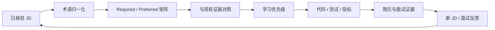

# 13 · 从 JD 反推 Agent 工程师学习路线

> 这不是一份“Agent 技术大全”。它回答的是另一个问题：目标岗位现在反复要求什么、哪些能力必须形成工程证据、哪些热门概念暂时不值得投入。

## 13.1 为什么从 JD 开始

常规学习路线容易把 Function Calling、RAG、MCP、Memory、多 Agent 和各种框架依次列一遍，却没有说明优先级。岗位导向学习需要同时看三个信号：

1. **市场频率**：多少份当前 JD 把它列为职责或硬要求。
2. **证据缺口**：现有项目能否证明，而不是本人是否“听说过”。
3. **目标权重**：当前最想申请的岗位是否把它当作核心能力。



学习的终点不是“看完”，而是让下一份简历多一个可以核验的证据。

## 13.2 2026-07 首轮 JD 信号

本轮抽取 12 份仍在招聘的 Agent / Applied AI / Agent Platform JD，覆盖 China/APAC Remote 候选岗位和新加坡市场基准岗位，共 10 家组织。表中的数量是**岗位数**，不是公司数。

| 能力信号 | 职责或硬要求 | 加分项 | 岗位含义 |
| --- | ---: | ---: | --- |
| Agent orchestration | 12/12 | 0 | 是岗位前提，不是差异化证据 |
| 工具与 API 集成 | 10/12 | 0 | Agent 必须能接真实系统 |
| Reliability | 11/12 | 0 | 生产岗位关心失败后的行为 |
| Evaluation | 9/12 | 0 | “感觉有效”已经不够 |
| Python 后端 | 9/12 | 1/12 | 当前最稳的服务端主语言 |
| 部署与 DevOps | 8/12 | 3/12 | Docker、CI、运行和排障是交付的一部分 |
| RAG / retrieval | 7/12 | 1/12 | 重点是检索质量，不是接一个向量库 |
| Safety / security | 7/12 | 0 | 权限、注入、审计、人工接管进入主线 |
| Observability | 6/12 | 1/12 | trace、指标和失败分类逐渐成为硬要求 |
| Context / memory | 6/12 | 0 | 长任务和个性化岗位更重视 |
| TypeScript / frontend | 4/12 | 4/12 | 产品型 Agent 岗位仍需要端到端能力 |
| Multi-agent | 3/12 | 1/12 | 不是入门优先级 |
| MCP（Model Context Protocol） | 2/12 | 1/12 | 对集成型岗位重要，但不是市场通用第一项 |
| 外部开源贡献 | 1/12 | 4/12 | 频率不高，但能形成强信任信号 |
| 英文沟通 | 7/12 | 0 | 海外岗位的独立能力线，不应被技术学习掩盖 |

样本不代表整个市场：同一组织可能发布多个相似岗位，岗位标题也会漂移。这里使用频率判断共性，再用目标岗位和个人差距调整顺序，不把 `9/12` 当成行业精确比例。

## 13.3 当前真正该学什么

### P0：Evaluation、Reliability、Observability

这三项应该一起学，因为它们回答同一个生产问题：系统有没有完成任务、为什么失败、失败后能否恢复。

最低工程证据：

- 20-50 条代表性任务和可重复的运行入口。
- task success rate、tool-call correctness、human takeover rate。
- p50/p95 latency、token 和单任务成本。
- 规划、检索、工具、权限、超时、外部系统等失败分类。
- retries、fallback、timeout、cancel、idempotency 的边界。
- 一条请求从用户输入到最终结果的完整 trace。

验收标准：主动注入至少 5 类故障，系统能停止、降级或转人工，并能从记录中定位原因。

相关笔记：[02 最佳实践](./02-agent-best-practices.md)、[08 Observability 与 Benchmark](./08-new-ai-concepts.md)。

### P0：Python 生产后端

JD 要的不是“会写 Python 脚本”，而是能维护异步、持久、有状态的 Agent 服务。

最低工程证据：

- FastAPI 或等价异步服务。
- PostgreSQL / Redis 等状态与任务持久化。
- API、任务队列、超时、取消和断点恢复。
- 单元测试、集成测试、Docker、CI。
- 结构化日志、指标与密钥管理。

验收标准：服务重启、重复请求和下游超时不会破坏任务状态。

### P0/P1：Context 与 Memory

频率不是最高，但它常常是产品型 Agent 的核心差异。不要把“把全部对话塞回模型”称为 memory。

应该掌握：

- 事实、偏好、任务状态和事件历史的分层。
- write、retrieve、update、invalidate 生命周期。
- 来源、时间、置信度、权限和失效条件。
- compaction 前后的行为一致性。
- 记忆污染与 prompt injection 防护。

验收标准：多轮修改和上下文压缩后，系统仍能使用最新偏好，并能解释记忆来源。

相关笔记：[07 Token 与长期记忆](./07-token-memory-multi-agent.md)。

### P1：RAG 与检索质量

重点不是 LangChain 调用方式，而是把检索错误和生成错误分开。

最低工程证据：

- 30 条以上问题、期望证据和不可回答样本。
- chunk、embedding、hybrid search、reranker 的对比。
- retrieval recall 与 answer groundedness 分开统计。
- 引用、权限过滤、索引更新和删除路径。
- 检索不足时拒绝编造。

验收标准：能说明一次错误发生在召回、重排还是生成阶段。

相关笔记：[08 Agentic RAG](./08-new-ai-concepts.md)。

### P1：Security 与 Human-in-the-loop

企业 Agent 的风险来自不可信输入、私有数据和可执行工具同时存在。学习重点是权限边界，而不是只加一句安全 Prompt。

最低工程证据：

- 工具白名单、最小权限和读写分级。
- 高风险动作人工批准。
- prompt injection 与 tool poisoning 测试。
- 凭据隔离、审计日志和数据脱敏。
- 可撤销、可重放、可追责的执行记录。

验收标准：面对恶意网页或文档，Agent 不会把内容当系统指令执行，也不会绕过审批做写操作。

相关笔记：[10 Agent 安全与攻防](./10-agent-security-threats.md)。

## 13.4 有基础后不要重复学什么

如果已经实现过 tool-calling loop、状态管理和真实工具执行，就不要继续重复做聊天 Demo。下一步应该在原项目上补：

| 已有能力 | 不再重复 | 应升级为 |
| --- | --- | --- |
| Tool calling | 再写一个天气工具 | schema 校验、超时、幂等、权限和失败恢复 |
| Agent loop | 换框架重写 ReAct | checkpoint、终止条件、预算和可观测性 |
| 流式 UI | 再做聊天气泡 | cancel、断线恢复、人工接管和执行状态 |
| 多模型接入 | 再接一家 API | model routing、fallback、成本和质量对比 |
| 产品工程 | 再做功能列表 | 用户结果、成功率和业务指标 |

项目深度比框架数量更能证明工程能力。

## 13.5 定向学习，不进入通用主线

### MCP

只有集成型或明确要求 MCP 的目标岗位，才值得优先发布一个 MCP server。验收不是“能启动”，而是：

- 有真实消费者和场景。
- tool/resource schema 清楚。
- 有权限、错误语义、测试和 quickstart。
- 至少被两个不同 client 使用过。

注意术语归一化：本轮有一份 JD 把 `MCP` 明确展开为 `Model-Controller-Proxy`，它不是 Model Context Protocol，统计时不能混在一起。

### 外部开源贡献

对以 integrations、developer ecosystem 为核心的岗位，这是强信号；对普通企业 Agent 岗位，它通常只是加分项。比起新建多个无人使用的仓库，更有效的是向不属于自己的项目提交 2-3 个被合并的功能或修复。

### Go、云厂商与行业栈

Go、AWS Bedrock、能源、金融、HRIS 等要求应该由具体目标岗位触发。先做到能读、能改、能写小型集成，不要因为一份 JD 改写整条通用路线。

## 13.6 暂缓项

### Multi-agent

首轮只有 3/12 作为硬要求。先把单 Agent 的状态、评测和失败恢复做扎实。多 Agent 的学习条件应是：任务确实存在可独立分工、需要隔离上下文，或者有明确的验证/对抗角色。

### 框架大全

不需要同时学习 LangGraph、CrewAI、AutoGen、LlamaIndex 和 Dify。选择一个能暴露状态、checkpoint、interrupt 和 trace 的框架作为载体；换框架不等于能力升级。

### Fine-tuning 与模型训练

本轮 Applied AI / Agent Engineer 样本没有把模型训练作为共性主线。除非目标岗位转向 Research / ML Engineer，否则先解决数据、检索、工具、评测和系统可靠性。

## 13.7 基于 JD 的六个学习 Sprint

| Sprint | 项目产物 | 通过标准 |
| --- | --- | --- |
| 1. Evaluation | golden set + runner + 指标报告 | 能稳定复现成功与失败 |
| 2. Reliability / Security | 故障注入 + 权限与审批 | 5 类故障可恢复或转人工 |
| 3. Context / Memory | 分层记忆 + 生命周期测试 | 压缩后仍保持最新偏好 |
| 4. RAG | 检索数据集 + 召回/生成分层指标 | 能定位召回或生成错误 |
| 5. Python Production | 异步服务 + 持久化 + Docker/CI | 重启、重复、超时不破坏状态 |
| 6. Target-specific | MCP / 外部 PR / Go 小服务 | 只服务于明确目标岗位 |

每个 Sprint 必须形成以下至少两项：代码、自动化测试、量化指标、英文技术说明、可演示流程、面试故事。

## 13.8 如何持续更新

1. 只采集仍有效且能看到完整正文的 JD。
2. 把职责/硬要求 `R` 与加分项 `P` 分开。
3. 先做术语归一化，再统计；同名缩写必须核对原文定义。
4. 同一公司同类岗位最多按两份计权。
5. 每新增 10 份已核验 JD，重新计算一次。
6. 只出现一次的特殊技术进入岗位定向，不进入通用学习路线。
7. 面试反馈的权重高于 JD 文案，因为它反映真实筛选过程。

## 推荐阅读路线

```text
01 知识体系
  -> 02 最佳实践
  -> 13 本文：确定岗位优先级
  -> 08 RAG / Eval / Observability
  -> 07 Context / Memory
  -> 10 Security
  -> 09 Harness Engineering
```

## 参考来源

访问日期：2026-07-18。

1. Anthropic Engineering. *Building Effective Agents*. https://www.anthropic.com/engineering/building-effective-agents
2. Anthropic Engineering. *Effective context engineering for AI agents*. https://www.anthropic.com/engineering/effective-context-engineering-for-ai-agents
3. Model Context Protocol 官方文档. https://modelcontextprotocol.io
4. OpenTelemetry. *Semantic conventions for generative AI systems*. https://opentelemetry.io/docs/specs/semconv/gen-ai/
5. OWASP. *Top 10 for Large Language Model Applications*. https://genai.owasp.org/llm-top-10/
6. LangGraph 官方文档. https://docs.langchain.com/oss/python/langgraph/overview
