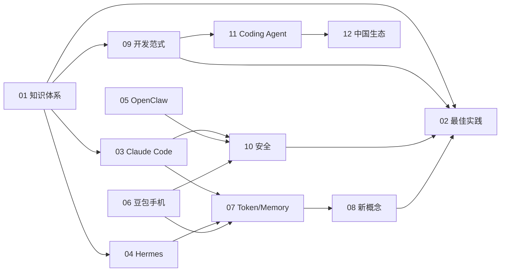

# Agent 知识体系 · 个人学习文档集

> 以**个人学习**为导向，按主题组织的 13 篇深度笔记。  
> 覆盖 Agent 基础、最佳实践、核心产品源码分析、安全、开发范式、中国生态。  
> 2026-04 整理，总字数 ~2.8 万字。所有文档含参考链接，便于拓展。

## 目录索引

| # | 文件 | 主题 | 深度 | 字数 |
| --- | --- | --- | --- | --- |
| 01 | [01-agent-knowledge-system.md](./01-agent-knowledge-system.md) | Agent 知识体系 | 入门 | ~2.5k |
| 02 | [02-agent-best-practices.md](./02-agent-best-practices.md) | 最佳实践（Prompt/Tool/Context/Eval） | 实战 | ~2.5k |
| 03 | [03-claude-code-leak-analysis.md](./03-claude-code-leak-analysis.md) | Claude Code 泄漏源码分析 | 源码级 | ~3k |
| 04 | [04-hermes-agent-internals.md](./04-hermes-agent-internals.md) | Hermes Agent 实现原理 | 源码级 | ~3k |
| 05 | [05-openclaw-internals-security.md](./05-openclaw-internals-security.md) | OpenClaw 实现与安全问题 | 源码级 | ~2.5k |
| 06 | [06-doubao-phone-os.md](./06-doubao-phone-os.md) | 豆包手机 OS 原理/安全/交互 | 中等 | ~2.5k |
| 07 | [07-token-memory-multi-agent.md](./07-token-memory-multi-agent.md) | Token 压缩 / 长期记忆 / 移动 / 多 Agent | 中等+ | ~3k |
| 08 | [08-new-ai-concepts.md](./08-new-ai-concepts.md) | AI 新概念（MCP/CUA/RAG 2.0/Observability/Eval/UX） | 中等 | ~2.5k |
| 09 | [09-ai-dev-paradigms.md](./09-ai-dev-paradigms.md) | AI 开发范式（SDD / Harness / Context Eng / Vibe） | 中等+ | ~2k |
| 10 | [10-agent-security-threats.md](./10-agent-security-threats.md) | Agent 安全与攻防（OWASP LLM Top 10 / Lethal Trifecta） | 中等+ | ~2k |
| 11 | [11-coding-agent-landscape.md](./11-coding-agent-landscape.md) | Coding Agent 横向对比（12 款产品） | 中等 | ~2k |
| 12 | [12-china-agent-ecosystem.md](./12-china-agent-ecosystem.md) | 中国 Agent 生态全景 | 中等 | ~2k |

## 推荐阅读路线

### 路线 A · 想先建立整体认知（推荐新手，约 2 小时）

```
01 → 02 → 08 → 09 → 11 → 12
```

先理解 Agent 的五大件和最佳实践，再看周边概念和开发范式，最后看行业版图。

### 路线 B · 想精读源码（需要一些工程背景，约 4-6 小时）

```
01 → 03 → 04 → 05 → 07 → 10
```

从整体认知入手，然后依次精读 Claude Code、Hermes、OpenClaw 三份源码级分析，最后在"token 压缩 / 记忆"和"安全"中落地。

### 路线 C · 关注安全与合规（约 2 小时）

```
05 → 06 → 10 → 02（对照最佳实践） → 09（Harness 角度）
```

安全视角从 OpenClaw 实际漏洞 → 豆包手机系统级权限 → OWASP LLM Top 10 全景。

### 路线 D · 关注中国市场 / 产品人（约 2 小时）

```
06 → 11 → 12 → 02 → 08
```

从豆包手机这个标志性事件切入，再看国内 Coding Agent 竞争，整体中国生态。

### 路线 E · 关注移动 / GUI Agent（约 2 小时）

```
06 → 07（移动章节） → 10 → 12（AutoGLM/UI-TARS 章节） → 08（CUA 章节）
```

## 交叉引用地图



## 核心约定

- **所有 .md 均已包含至少一个表格、一张图/流程、以及参考链接清单**。
- 所有源链接访问日期 **2026-04-18**。
- 本文档不适合作为商业报告，仅供个人学习参考。
- 外文术语在第一次出现时保留英文，以便搜索。

## 关键术语一页速查

| 术语 | 含义 | 相关文档 |
| --- | --- | --- |
| ReAct | Reason + Act 基础 Agent 循环 | 01, 02 |
| MCP | Model Context Protocol，统一工具协议 | 08 |
| CLAUDE.md / AGENTS.md | Agent 级项目规约文件 | 02, 09, 11 |
| DYNAMIC_BOUNDARY | Claude Code 提示词缓存分界 | 03 |
| Skills / SKILL.md | 懒加载能力包 | 02, 03, 08 |
| Harness Engineering | 给 Agent 设计"操作系统" | 09 |
| SDD | Spec-Driven Development | 09 |
| Lethal Trifecta | 三要素危险组合（私有数据+不可信输入+外发通路） | 10 |
| OWASP LLM Top 10 | LLM 应用安全十大风险 | 10 |
| Computer-Using Agent (CUA) | 让 Agent 像人一样用电脑/手机 | 08, 06, 07 |
| Sandbox | 执行环境隔离 | 05, 10 |
| Blast Radius | 错误影响范围 | 02 |

## 自审清单

- [x] 每篇 >= 1 张表 + 1 张 Mermaid/流程图 + 完整参考来源
- [x] 关键数据双源交叉（源码 + 官方公告 / 社区分析）
- [x] 所有 URL 可点击（访问日期 2026-04-18）
- [x] 中英术语混写，便于检索
- [x] README 索引 + 5 条阅读路线

## 作者备注

- 本文档集为"研究型学习笔记"，不构成投资 / 技术选型建议。
- 泄漏类资料（Claude Code 03 章）仅用于架构学习，不转载代码。
- 任何安全结论均以**官方 Issue / CVE / 厂商公告** 为第一手来源。

---

最后更新：2026-04-18
