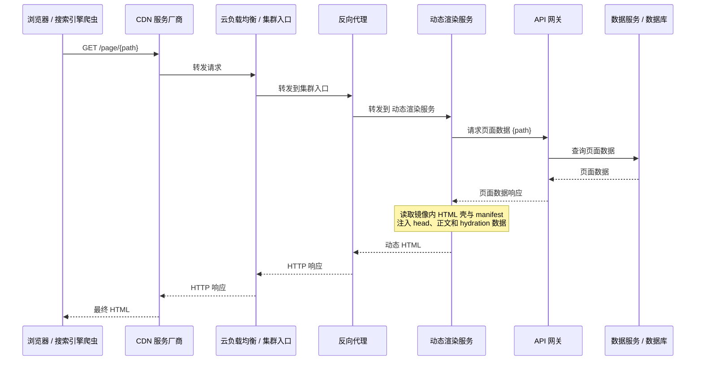
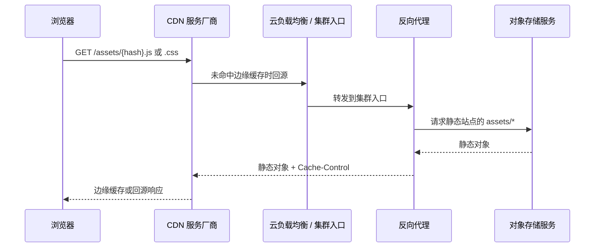
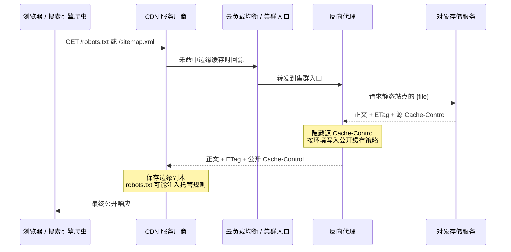
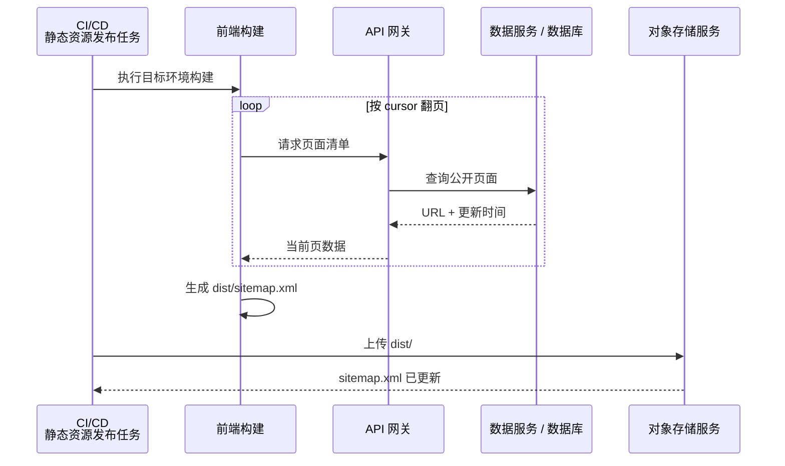

# 前端资源交付链路与多层缓存排障

## 定位

前端资源问题经常表现为“每一层看起来都正常，但用户仍拿到旧内容或错误内容”：

- 数据接口已经返回新数据，公网 HTML 或固定站点文件仍是旧版本。
- 对象存储的正文和 metadata 已更新，公网响应头仍保留旧缓存策略。
- CDN 缓存清理已经成功，下一次回源后又缓存了错误版本。
- 动态渲染服务已经上线，请求却仍落到静态站点。
- 远程构建任务已创建，CI 因无法读取日志而显示失败。
- HTML 返回 200，但引用的 hash 资源不存在，页面仍无法正常运行。

这些通常不是单点代码问题，而是构建、发布、路由、缓存和客户端状态没有同时完成切换。

## 核心判断

排障前先回答四个问题：

1. 这个 URL 属于动态 HTML、静态资源，还是固定站点文件？
2. 正文由哪个服务生成或保存？
3. 用户读取它时会经过哪些转发、改写和缓存层？
4. 新版本写入源站时走的是哪条发布链？

只有同时画清读取链和写入链，才能定位旧内容究竟停在哪一层。

## 前端资源的真实服务链路

### 先区分资源类型与响应来源

动态 HTML、客户端静态资源和固定站点文件走的是不同链路。只有先确认资源类型和响应来源，才能判断旧内容缓存在哪一层。

#### 动态 HTML：运行时生成



这里返回的 HTML 不来自对象存储服务。HTML 壳和 manifest 已随服务镜像发布；动态 head、正文和 hydration 数据由渲染服务在请求时注入。


#### 静态资源：JS、CSS、字体和图片

动态 HTML 返回后，浏览器会另外请求静态资源：



因此“HTML 已 SSR”与“页面能正常 hydration”是两项独立验收。动态渲染服务正常但对象存储中没有同一 revision 的 hash 资源时，首个 HTML 可以是 200，后续脚本仍会 404。

#### 固定站点文件：公开读取链



这些固定站点文件的读取请求不会经过动态渲染服务或数据 API。数据源正确但公开文件仍旧时，应该检查构建与对象存储发布，不应该检查动态 HTML 请求日志。

#### 固定站点文件：构建写入链



固定站点文件在构建时读取数据源，在访问时只读取对象存储。数据源已有新内容不会自动修改公开文件，必须重新构建并发布。

### 构建产物必须覆盖实际运行方式

静态站点与动态渲染服务的产物不同。一个稳定的前端 SSR 交付物至少包含：

```text
dist/
├── client/
│   ├── page-shell.html
│   └── assets/
├── manifest.json
└── server/
    └── index.mjs
```

- HTML 壳和带 hash 的静态资源由浏览器加载。
- manifest 用于把逻辑入口解析为当前版本的客户端资源；实际路径由构建配置决定。
- server bundle 是生产动态渲染入口。
- 静态资源与动态渲染镜像必须来自同一 revision，否则 HTML 可能引用不存在的 hash 文件。

直接用源码运行器执行服务端源码，通常依赖源码目录、开发运行器和完整依赖，适合本地联调，不应当作正式生产产物。
### 将缓存能力对应到交付层

| 层 | 处理哪些请求 | 缓存或改写什么 | 识别方式 |
|---|---|---|---|
| 动态渲染服务 | `/page/{path}` | 按请求生成 HTML；容器内的 HTML 壳、manifest 和 server bundle 随镜像版本固定 | 响应包含服务端运行时标识；原始 HTML 有动态 head 和非空正文 |
| API 网关 / 数据服务 | 动态 HTML 的页面数据查询、固定站点文件的构建查询 | 可能使用既有应用缓存或数据库索引；不负责公开 HTML、robots 或 sitemap 的 HTTP 缓存 | 查内部接口耗时、日志与数据；不会产生公网 `Age` / 厂商自定义缓存状态头 |
| 对象存储服务 | JS/CSS、HTML 静态壳、robots.txt、sitemap.xml | 保存对象正文、metadata、ETag 和版本信息；不生成动态 HTML | 直连 `对象存储源站`，查看 `对象版本号`、ETag、Cache-Control |
| 反向代理 | 所有公网请求的集群入口 | 当前未启用正文缓存，但会决定动态渲染服务与对象存储上游，并可能覆盖源站 Cache-Control | 对照线上运行实例 配置；看 upstream 与公开 Cache-Control |
| 云负载均衡 / 集群入口 | CDN 服务厂商到反向代理的转发 | 通常只做负载均衡；若另行启用 CDN 缓存才会增加缓存层，不能仅凭 `Via` 认定已缓存 | 查负载均衡、CDN 配置与响应头 |
| CDN 服务厂商 | 所有公开 URL | 按最终 Cache-Control 保存边缘副本；缓存清理只删除当前副本；托管 robots.txt 功能还可能改写 robots 正文 | 厂商自定义缓存状态头、`Age`、CDN 服务厂商控制台与公开 robots 正文 |
| 浏览器 | 用户实际访问 | 缓存 hash 静态资源，也可能保存 robots/sitemap 后重新校验 | 浏览器开发者工具、强制重新校验、ETag/304 |
| 搜索引擎爬虫 / 站长工具 | 抓取和索引 | 独立缓存 robots.txt，并维护发现、抓取、规范化、索引等异步状态 | robots 报告、网址检查、索引覆盖率报告 |

最容易混淆的四点：

1. 反向代理若隐藏源站的 Cache-Control 并写入新值，公网策略就由反向代理决定；只改对象存储服务 metadata 不会改变最终响应。
2. CDN 服务厂商的缓存清理只删除当前边缘副本，不会修改下一次响应的缓存策略。
3. CDN 服务厂商的托管 robots.txt 可能注入 `额外内容策略声明` 和训练爬虫规则，公开正文与源站对象不完全相同。
4. 搜索引擎爬虫还会独立缓存 robots.txt。公网已更新，不代表站长工具立即丢弃旧判断。

## 排障与修复方法

### 1. 先确认资源归属

- 动态 HTML：正文通常由渲染服务运行时生成，数据 API 只提供页面数据。
- JS、CSS、字体和图片：正文通常来自对象存储或静态源站。
- robots.txt、sitemap.xml 等固定站点文件：通常在构建或发布阶段生成，访问时直接读取静态源站。
- 同一路径返回旧内容时，先确认请求实际命中的上游，不要根据预期架构猜测。

后端数据正确只能证明数据源正常，不能证明前端构建、对象存储、反向代理或 CDN 已更新。

### 2. 按读取链从内向外比较

排查顺序固定为：

1. 检查构建产物或数据源，确认期望内容确实存在。
2. 直连动态渲染服务或对象存储源站，确认源响应。
3. 经过反向代理访问，确认路由和响应头改写。
4. 经过公网 CDN 访问，确认边缘缓存状态。
5. 最后检查浏览器、爬虫或其他客户端的独立缓存。

每一层都同时比较：

- 状态码与正文。
- Cache-Control、ETag、Last-Modified。
- Age、Via 和 CDN 厂商自定义缓存状态头。
- 能识别真实上游的运行时标识或调试响应头。

只比较正文会漏掉错误缓存策略，只比较响应头又可能漏掉回源到错误服务。

### 3. 把构建产物当成部署接口

- 静态站点构建必须产出 HTML 壳和所有带 hash 的客户端资源。
- 动态渲染构建还必须产出服务端 bundle 与 manifest。
- 对象存储中的静态产物与动态渲染镜像应来自同一 revision。
- 若部署系统从提交快照生成构建上下文，未提交的工作区文件不会进入产物。
- HTML 返回 200 之后，还必须验证其中引用的 JS、CSS、字体和图片都能成功加载。

动态渲染服务只应通过明确的服务端契约获取页面数据；浏览器凭证不应被无差别透传到可缓存的 HTML 响应。

### 4. 按资源类型拆分路由

先在集群内验证服务发现和健康检查，再切换反向代理：

```text
/page/{path}     → 动态渲染服务
/assets/*           → 对象存储服务
/robots.txt         → 固定站点文件
/sitemap.xml        → 固定站点文件
/other/*            → 现有前端应用
```

路由规则必须足够精确。一个过宽的前缀匹配可能把静态资源交给动态服务，也可能把现有前端页面错误切到新服务。

同时核对配置仓中的期望规则和线上运行实例的实际规则；配置已合并不代表所有实例已经滚动到新版本。

### 5. 区分缓存策略与缓存失效

固定 URL、内容会变化的资源适合重新校验缓存：

```http
Cache-Control: no-cache, max-age=0, must-revalidate
ETag: <对象版本标识>
```

这里的 no-cache 不是禁止保存，而是允许保存、每次使用前必须向源站校验。未变化可返回 304，变化后立即取得新版本。

| 资源 | 推荐策略 |
|---|---|
| HTML、robots.txt、sitemap.xml | 每次重新校验 |
| 带 hash 的 JS/CSS | 长缓存并标记 immutable |
| 普通图片与媒体 | 按更新频率和成本单独制定 |

修复顺序必须是：

1. 修改构建脚本、对象 metadata 或反向代理中的持久配置。
2. 更新当前源站对象或动态服务版本。
3. 按 URL 精确清理 CDN 边缘副本。
4. 重新请求并确认下一份副本使用了新策略。

只清理缓存不会改变下一次回源的缓存策略，错误配置会再次生成同样的旧副本。

### 6. 区分远程任务失败与日志读取失败

构建提交命令可能已经成功创建远程任务，但本地 CLI 因无权读取日志而退出。此时不要直接认定产物没有生成：

1. 按任务 ID 查询远程最终状态。
2. 使用异步提交加状态轮询，或把日志写入调用方有权限的集中日志服务。
3. 只有远程任务失败或目标产物不存在时才重新构建。

## 验证

### 动态 HTML

浏览器渲染后的 DOM 不能证明服务端响应正确，必须检查未执行 JavaScript 的原始响应：

```bash
SITE_ORIGIN="https://example.com"
PAGE_PATH="/page/example"
curl -sS -D /tmp/page.headers "${SITE_ORIGIN}${PAGE_PATH}" -o /tmp/page.html
rg -n '<title>|<script|stylesheet|id="root"' /tmp/page.html
```

通过标准：

- 状态码符合预期，原始 HTML 已包含当前页面内容。
- HTML 引用的客户端资源属于当前 revision。
- 动态页面没有退化为固定 HTML 壳或空容器。
- 错误页面不会被 CDN 当成长期成功响应缓存。

### 静态资源

从 HTML 中选取一个实际的 hash 资源，分别检查正文和缓存头：

```bash
ASSET_URL="${SITE_ORIGIN}/assets/example.hash.js"
curl -sSI "${ASSET_URL}" | rg -i 'http/|content-type|content-length|cache-control|etag|age|via'
```

通过标准：

- 资源返回 200，Content-Type 正确。
- HTML 与对象存储中都存在同一 revision 的文件。
- 带 hash 的资源可以长缓存；固定文件名资源必须按更新频率设置策略。

### 固定站点文件

```bash
curl -sS "${SITE_ORIGIN}/robots.txt"
curl -sSI "${SITE_ORIGIN}/robots.txt" | rg -i 'http/|cache-control|etag|age|via'
curl -sSI "${SITE_ORIGIN}/sitemap.xml" | rg -i 'http/|cache-control|etag|age|via'
```

排查顺序仍是对象存储源站、反向代理、公网 CDN、客户端。数据 API 是否返回新数据，不能直接证明这些固定文件已重新构建并发布。

## 模式抽象

1. **资源类型决定服务链路。** 动态 HTML、hash 静态资源和固定站点文件不能用同一套排障假设。
2. **读取链与写入链是两条独立链路。** 源数据更新不代表公开资源已经重新构建和发布。
3. **缓存策略与缓存失效是两件事。** 清理处理旧副本，配置决定下一份副本如何缓存。
4. **构建产物是部署接口。** 正式运行所需的 manifest、服务端 bundle 和静态资源必须显式产出。
5. **逐层比较优于端到端猜测。** 每层都检查正文、响应头和真实上游，才能定位旧内容停在哪里。
6. **公网响应才是用户视角的真相。** 内部服务正常、配置已合并或发布任务成功，都不能替代最终 URL 验证。
