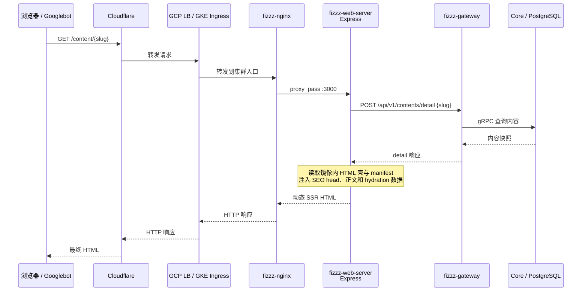
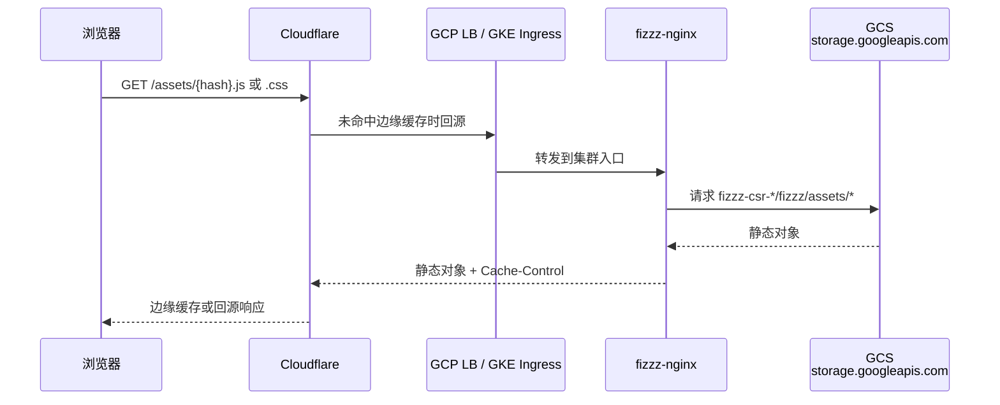
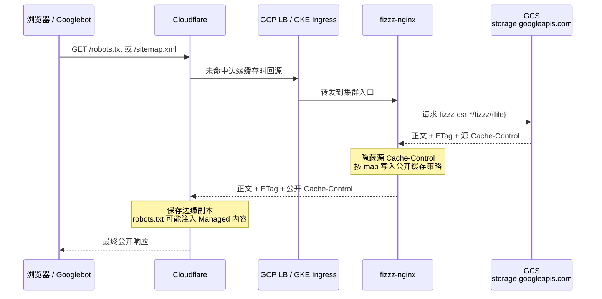
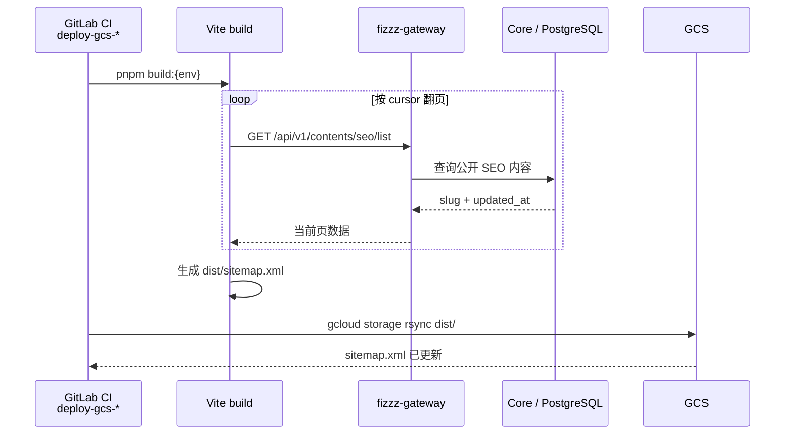

# SEO SSR 生产交付与多层缓存排障

## 现象

SEO SSR 上线容易出现“每一段看起来都正常，但搜索引擎仍看不到页面”的情况：

- 浏览器能正常显示内容，`curl` 获取的原始 HTML 却仍是固定 title、错误 canonical、空的 `#root`。
- 后端 sitemap 数据接口已有数千条记录，公开的 `sitemap.xml` 仍只有几个静态页面。
- GCS 对象 metadata 已改成 `no-cache`，公网仍返回 14 天强缓存。
- Cloudflare Purge 已成功，Search Console 仍报告被旧 `robots.txt` 屏蔽。
- Cloud Build 已创建远端构建，CI 却因无权读取日志而立即失败。

这些通常不是一个代码 bug，而是数据、构建、运行、路由、缓存和爬虫状态没有同时完成切换。

## 根因

### 先分清实际请求经过哪些服务

SEO 页面、客户端静态资源和爬虫控制文件走的是不同链路。只有先画清请求路径，才能判断旧内容缓存在哪一层。

#### `/content/{slug}`：SSR HTML



这里返回的 HTML 不来自 GCS。HTML 壳和 manifest 已随 Docker 镜像复制到 Node 容器；动态 title、canonical、正文和 hydration 数据由 Express 每次请求时注入。

数字 ID 的请求经过相同链路，但 SSR 在取得内容的 slug 后先返回 301；客户端再以 slug 发起第二次请求。

#### HTML 中的 JS、CSS、字体和图片

SSR HTML 返回后，浏览器会另外请求静态资源：



因此“HTML 已 SSR”与“页面能正常 hydration”是两项独立验收。Node 服务正常但 GCS 没有同一 commit 的 hash 资源时，首个 HTML 可以是 200，后续脚本仍会 404。

#### `/robots.txt` 与 `/sitemap.xml`：公开读取链



这两个请求不会经过 `fizzz-web-server`、Gateway 或 Core。后端数据正确但公开 sitemap 仍旧，应该查生成与 GCS 发布，不应该查 SSR 请求日志。

#### `sitemap.xml`：构建写入链



sitemap 在构建时读取后端、在访问时只读取 GCS。接口已有新数据不会自动修改 GCS 对象，必须重新构建并发布。

### CSR 产物不等于 SSR 产物

典型 Vite SSR 的正式产物同时包含两部分：

```text
dist/
├── share-landing.html
├── assets/
├── .vite/manifest.json
└── server/index.mjs
```

- `assets/` 和 HTML 壳给浏览器加载与 hydration。
- `dist/.vite/manifest.json` 用于从逻辑入口解析带 hash 的客户端脚本；不要假设它位于 `dist/manifest.json`。
- `dist/server/index.mjs` 才是生产 Node 入口。

直接执行 `tsx server/index.ts` 需要源码、TypeScript 运行器和完整 `node_modules`，适合本地联调，不是稳定的生产交付物。生产镜像应只携带编译后的 `dist/`，用 Node 直接启动服务端 bundle。

### 将缓存对应到具体服务

| 层 | 处理哪些请求 | 缓存或改写什么 | 识别方式 |
|---|---|---|---|
| Node SSR | `/content/{slug\|id}` | 当前实现按请求生成 HTML；容器内的 HTML 壳、manifest 和 server bundle 随镜像版本固定 | `x-powered-by: Express`；原始 HTML 有动态 head 和非空正文 |
| Gateway / Core | SSR 的内部内容查询、sitemap 构建查询 | 可能使用既有应用缓存或数据库索引；不负责公开 HTML、robots 或 sitemap 的 HTTP 缓存 | 查内部接口耗时、日志与数据；不会产生公网 `Age` / `CF-Cache-Status` |
| GCS | JS/CSS、HTML 静态壳、robots.txt、sitemap.xml | 保存对象正文、metadata、ETag 和 generation；不生成 SSR HTML | 直连 `storage.googleapis.com`，查看 `x-goog-generation`、ETag、Cache-Control |
| fizzz-nginx | 所有公网请求的集群入口 | 当前未使用 `proxy_cache` 保存正文，但会决定 SSR/GCS 上游，并覆盖 GCS 的 Cache-Control | 对照线上 Pod 配置；看 upstream 与公开 Cache-Control |
| GCP Load Balancer / Ingress | Cloudflare 到 Nginx 的转发 | 通常只做负载均衡；若另行启用 Cloud CDN 才会增加缓存层，不能仅凭 `via: 1.1 google` 认定已缓存 | 查 BackendConfig / Cloud CDN 配置与响应头 |
| Cloudflare | 所有公开 URL | 按最终 Cache-Control 保存边缘副本；Purge 只删除当前副本；Managed robots.txt 还可能改写 robots 正文 | `CF-Cache-Status`、`Age`、Cloudflare 控制台与公开 robots 正文 |
| 浏览器 | 用户实际访问 | 缓存 hash 静态资源，也可能保存 robots/sitemap 后重新校验 | DevTools、强制重新校验、ETag/304 |
| Googlebot / Search Console | 抓取和索引 | 独立缓存 robots.txt，并维护发现、抓取、规范化、索引等异步状态 | robots 报告、URL Inspection、Page Indexing |

最容易混淆的四点：

1. Nginx 若使用 `proxy_hide_header Cache-Control` 再 `add_header`，公网策略由 Nginx 决定；只改 GCS metadata 不会改变最终响应。
2. Cloudflare Purge 只删除当前边缘副本，不会修改下一次响应的缓存策略。
3. Cloudflare Managed robots.txt 可能注入 `Content-Signal` 和训练爬虫规则，公开正文与源站对象不完全相同。
4. Googlebot 还会独立缓存 robots.txt。公网已更新，不代表 Search Console 立即丢弃旧判断。

## 修复

### 1. 先保证数据口径一致

- 开发前先查现有 migration 和实际环境，避免为已有字段再建平行列。
- slug 一旦对外使用应保持不可变；标题修改不应重算 canonical URL。
- 发布 eligibility 与存量回填必须复用同一生成逻辑，避免增量和存量产出不同。
- 所有能让内容进入公开已发布状态的写面都要挂载 slug 生成，并用测试逐个覆盖。只测 helper 无法防止漏挂调用点。
- sitemap 数据源应固定过滤公开、已发布、审核通过且 slug 非空的内容，不允许调用方通过参数放宽安全条件。

如果依赖 PostgreSQL 唯一索引处理 slug 冲突，不能在普通事务内“撞唯一约束后继续重试”：任一 SQL 错误会让事务进入 aborted 状态。简单方案是在事务外用查询探测候选占用，事务内只做最终写入，唯一索引保留为最后防线。

### 2. 把构建产物当成运行契约

- SSR 构建必须同时产出 HTML 壳、客户端 hash 资源、manifest 和 Node bundle。
- GCS 静态产物与 SSR 镜像应来自同一 commit，避免 HTML 引用不存在的脚本或发生 hydration 版本不一致。
- 部署脚本若用 `git archive HEAD` 生成 Cloud Build 上下文，未提交的工作区文件不会进入镜像。
- SSR 服务应通过现有匿名 Gateway 契约取内容，不直接复制后端门禁逻辑，也不透传浏览器 Cookie 或 Authorization。否则登录用户访问私有内容时，可能生成可被缓存或索引的 HTML。

### 3. 路由只切需要 SSR 的页面

先在集群内验证 Service、endpoints 和健康检查，再切 Nginx：

```text
/content/{slug|id}       → Node SSR
/content/{id}/live       → 原 SPA / 播放链路
/assets/*                → GCS
```

播放页、创建页或其他有业务副作用的页面不应因为共享 `/content/` 前缀而一起交给爬虫。

环境索引策略默认关闭：

- UAT：robots.txt 全站禁止抓取，并统一返回 `X-Robots-Tag: noindex, nofollow, noarchive`。
- Prod：只有成功且满足公开条件的页面返回 `index,follow`。
- 404、410、502 和业务不可见页面始终 noindex。

### 4. 为固定 SEO 文件使用重新校验缓存

`robots.txt` 和 `sitemap.xml` 必须保持标准固定 URL，不能像 JS/CSS 一样加 hash；但固定 URL 的内容又会变化，因此适合：

```http
Cache-Control: no-cache, max-age=0, must-revalidate
ETag: "..."
```

这里的 `no-cache` 不是禁止保存，而是允许保存、每次使用前必须向源站校验。未变化可返回 304，变化后立即取得新版本。

推荐策略：

| 资源 | 缓存策略 |
|---|---|
| HTML、robots.txt、sitemap.xml | 每次重新校验 |
| 带 hash 的 JS/CSS | 长缓存并标记 immutable |
| 普通图片与媒体 | 按更新频率和成本单独制定 |

修复顺序必须是：先修改持久配置，再更新当前对象 metadata，最后按 URL 精确 Purge Cloudflare。只做 Purge 会在下一次回源后重新缓存错误策略。

### 5. 区分构建失败与日志流失败

`gcloud builds submit` 可能已经成功创建远端 build，但本地 CLI 因无权读取默认日志桶而退出 1。此时不要直接认定镜像没有构建：

1. 先按 build ID 查询远端最终状态。
2. 使用 `CLOUD_LOGGING_ONLY` 或项目已有的异步提交加轮询模式，避免日志查看权限阻塞构建结果。
3. 只有远端 build 失败或目标镜像不存在时才重新构建。

## 验证

### 原始 HTML

浏览器渲染后的 DOM 不能证明 SSR 正常，必须看未执行 JavaScript 的响应：

```bash
SEO_SITE_ORIGIN="https://example.com"
SEO_SLUG="实际 slug"

curl -sS -D /tmp/seo.headers \
  "${SEO_SITE_ORIGIN}/content/${SEO_SLUG}" \
  -o /tmp/seo.html

rg -n '<title>|canonical|name="robots"|og:title|application/ld\+json|id="root"' \
  /tmp/seo.html
```

通过标准：

- 200 响应直接包含动态 title、description、canonical、OG、JSON-LD 和非空首屏正文。
- canonical 自指 slug URL。
- 数字 ID URL 301 到 slug URL。
- 不存在或不可见内容返回 404/410，并带 noindex。
- 响应不再出现 GCS 静态对象特征；若仍有固定 title 和空 `#root`，说明请求没有进入 SSR 服务。

### robots、sitemap 与缓存层

```bash
curl -sS "${SEO_SITE_ORIGIN}/robots.txt"
curl -sSI "${SEO_SITE_ORIGIN}/robots.txt" \
  | rg -i 'cache-control|etag|cf-cache-status|age'
curl -sSI "${SEO_SITE_ORIGIN}/sitemap.xml" \
  | rg -i 'cache-control|etag|cf-cache-status|age'
```

排查顺序固定为：

1. 直连 GCS，确认对象正文、metadata 和 ETag。
2. 确认线上 Nginx 配置及实际 Pod 已包含新规则。
3. 确认 Cloudflare 是否仍返回旧 `Age` 或 `CF-Cache-Status: HIT`。
4. 最后再看 Search Console。

Search Console 中 sitemap 显示 Success 和 Discovered pages，只表示 Google 已读取 URL 列表，不表示页面已经抓取或编入索引。robots.txt 重新抓取也是 best-effort；内部报告深链可能随账号和产品版本变化，应从已验证的站点属性内导航，不要依赖猜测的固定深链。

## 模式抽象

1. **发布成功不等于可索引。** SEO 上线完成标准必须覆盖数据、原始 HTML、路由、索引信号、缓存和爬虫发现。
2. **缓存策略与缓存失效是两件事。** Purge 处理旧副本，配置决定下一份副本如何缓存；两者必须分别验证。
3. **逐层验证优于端到端猜测。** 每层都同时检查正文、响应头和上游身份，才能定位是谁仍在返回旧内容。
4. **非生产环境默认禁止索引。** noindex 应由服务端响应头和 robots.txt 双重保证，不能依赖开发人员记得关闭。
5. **构建产物是部署接口。** 正式运行时需要的 manifest、服务端 bundle 和静态资源都应在构建阶段显式产出，不能依赖源码目录偶然存在。
6. **搜索引擎状态最终一致。** 公网技术条件全部正确后，抓取与收录仍可能延迟；用 Search Console 观察，不把短期旧状态反推成代码仍错误。
