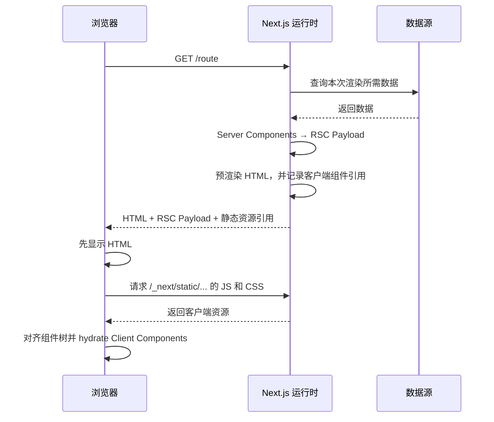

# Next.js SSR 生产运行模型与交付边界

## 1. 定位

Next.js 已经把 React SSR 的底层调用闭环起来。日常使用 App Router 时，工程师通常不需要自己调用 `renderToString`、`renderToPipeableStream` 或 `hydrateRoot`。

但框架代劳不等于生产边界消失。上线后仍然要回答四个问题：

1. 首次请求由谁生成 HTML？
2. 哪些代码只在服务端运行，哪些代码会进入浏览器？
3. 构建产物中哪些文件必须一起发布？
4. 页面异常时，问题发生在渲染、静态资源、缓存，还是客户端接管？

本文使用 Next.js App Router 作为语境，重点解释生产运行模型，不展开手写 React SSR 教程。

## 2. App Router 的首次请求不是单一 HTML

App Router 的页面和布局默认是 Server Components。首次请求时，Next.js 会在服务端完成 Server Components 渲染，生成 React Server Component Payload（RSC Payload），并预渲染可立即展示的 HTML。浏览器随后使用 RSC Payload 对齐组件树，再用客户端 JavaScript 接管 Client Components。



因此，首次页面可见和页面可交互不是同一个时刻：

- HTML 到达后，用户可以先看到预渲染结果。
- RSC Payload 帮助客户端还原 Server Components 与 Client Components 的关系。
- Client Component 的 JavaScript 到达后，React 才能绑定事件和状态。

后续通过 `<Link>` 等方式导航时，Next.js 通常复用客户端路由，不必每次都重新下载完整 HTML 文档。

## 3. Next.js 已经替你做了什么

| 能力 | Next.js 的职责 |
| --- | --- |
| 路由 | 根据 `app/` 文件结构匹配页面、布局和边界文件 |
| 服务端渲染 | 执行 Server Components，并按配置决定构建时或请求时渲染 |
| RSC 协议 | 生成并传输 RSC Payload，帮助客户端更新组件树 |
| HTML 预渲染 | 为首次加载生成可直接显示的 HTML |
| 客户端资源 | 拆分 Client Components 所需的 JavaScript 与 CSS |
| Hydration | 在框架内部调用 React 客户端能力，接管需要交互的组件 |
| 导航 | 预取、客户端转场、流式传输和路由状态管理 |

所以 `hydrateRoot` 对 Next.js 应用更像底层概念：需要理解它解决什么问题，但一般不应该在业务代码里手动调用。

## 4. 框架没有替你决定的边界

### 4.1 Server Component 与 Client Component

- 页面和布局默认是 Server Components，适合取数、读取服务端配置和减少浏览器 JavaScript。
- 需要状态、事件、Effect 或浏览器 API 的组件使用 `'use client'`。
- `'use client'` 是模块图边界：该文件及其导入链会进入客户端依赖图，所以边界应尽量靠近真正需要交互的叶子组件。
- Client Component 在首次请求中仍然可以被预渲染成 HTML；Client 不等于只做 CSR。
- Server Component 可以组合 Client Component，但服务端对象传给客户端前必须满足可序列化约束。

### 4.2 数据的渲染时机

同一个 App Router 项目可以同时存在：

- 构建时预渲染的页面。
- 请求时动态渲染的页面。
- 缓存后按策略重新验证的页面。
- 仅在浏览器取数的局部交互。

选择标准不是 SSR 或 CSR 二选一，而是这份数据由谁拥有、何时才能确定、是否依赖本次请求，以及允许陈旧多久。

### 4.3 环境变量

- 默认环境变量只在服务端可见。
- `NEXT_PUBLIC_` 前缀变量会在构建时写入客户端 JavaScript，构建完成后不会随运行容器的环境变量变化。
- 同一个镜像跨环境发布时，服务端运行时变量可以变化，但已写入客户端 bundle 的公开变量仍是构建时值。

因此，公开变量是构建输入；私密或请求相关变量才适合由服务端在运行时读取。

## 5. 三种生产交付模式

### 5.1 Node.js Server

```bash
pnpm build
pnpm start
```

`next build` 生成生产构建，`next start` 启动 Next.js 生产服务器。这是功能最完整的自托管方式，支持请求时渲染、Server Actions、Route Handlers、ISR 等服务端能力。

部署单元通常需要应用代码、`.next` 构建结果、生产依赖和 `public` 资源。具体复制方式取决于镜像策略，但这些内容必须来自同一次构建。

### 5.2 Standalone Output

```ts
// next.config.ts
const nextConfig = {
  output: 'standalone',
}

export default nextConfig
```

构建后会生成 `.next/standalone`，其中包含最小服务器和追踪到的运行时依赖，可使用：

```bash
node .next/standalone/server.js
```

Standalone 不会默认复制 `public` 和 `.next/static`。有两种正确交付方式：

1. 由独立静态资源层提供它们。
2. 把它们复制到 standalone 目录的对应位置，由最小服务器提供。

如果只发布 `.next/standalone` 而遗漏客户端资源，HTML 可能返回成功，但样式、脚本或 hydration 会失败。

### 5.3 Static Export

```ts
// next.config.ts
const nextConfig = {
  output: 'export',
}

export default nextConfig
```

构建后生成 `out/`，里面是可以由普通静态文件服务器提供的 HTML、CSS 和 JavaScript。Server Components 会在构建时执行，不存在处理每次页面请求的 Next.js 运行时服务器。

因此，Static Export 可以有预渲染 HTML，但不是请求时 SSR。依赖 cookies、请求头、动态重写、Server Actions、ISR 或其他运行时服务端能力的页面不适合这种模式。

### 5.4 不要轻易引入 Custom Server

Next.js 默认服务器已经覆盖绝大多数场景。只有集成式路由无法满足明确需求时才考虑 Custom Server；它会增加部署和优化负担，也不能与 standalone 的最小服务器直接等价替换。

## 6. Hydration 的工程含义

Hydration 是 React 在浏览器中把交互逻辑绑定到既有服务端 HTML 的过程。Next.js 会替应用完成入口调用，但必须满足一个核心不变量：服务端输出与客户端第一次渲染应一致。

常见不一致来源包括：

- 在 render 阶段读取 `window`、`localStorage`、`navigator` 等浏览器 API。
- 使用当前时间、随机数或依赖机器时区的格式化结果。
- 服务端和浏览器读取了不同版本的数据。
- 根据 `typeof window !== 'undefined'` 在首次 render 中直接返回不同结构。
- HTML 标签嵌套不合法。
- 浏览器扩展或中间代理改写了 HTML。

处理原则：

1. 先保证服务端 HTML 与客户端首次 render 确定且一致。
2. 浏览器专属逻辑放进 Client Component 的 Effect，或明确关闭某个局部组件的预渲染。
3. `suppressHydrationWarning` 只用于确实无法避免的单层差异，不应当用来掩盖普通 bug。

## 7. 构建产物是部署接口

Next.js 构建产物不是任意挑选的文件集合。服务端代码、RSC 产物、客户端 chunk、CSS 和公开资源之间存在版本关系。

最重要的发布不变量是：

```text
同一次构建的服务端产物
  + 同一次构建的 /_next/static 资源
  + 同一次构建的 public 资源
  + 与该构建匹配的环境配置
  = 一个可验证的发布单元
```

如果服务端已经升级，而静态资源层仍返回旧 chunk，或者 HTML 指向的 chunk 尚未上传，就会出现版本偏斜：页面可能白屏、404、无法 hydration，或只在发布窗口内偶发失败。

滚动发布和多实例部署时，还要确保实例使用一致的构建标识、Server Actions 加密配置和缓存协调策略。

## 8. 缓存不是一层

Next.js 生产问题经常被笼统描述为缓存，其实至少要区分：

| 层级 | 可能缓存什么 | 常见风险 |
| --- | --- | --- |
| Next.js 数据与路由层 | 取数结果、预渲染结果、重新验证状态 | 配置与当前版本语义不一致 |
| 进程或多实例层 | 内存缓存、实例本地状态 | 不同实例返回不同版本 |
| 反向代理或 CDN | HTML、RSC 响应、静态资源 | 动态页面被公开缓存，或 `Vary` 被忽略 |
| 浏览器 | HTML、JS、CSS、图片 | 旧 HTML 引用新资源，或旧资源长期不校验 |
| 客户端路由 | 已预取的 RSC Payload 与路由状态 | 用户导航结果和强刷结果不同 |

排障时要先回答命中的是哪一层，再决定清缓存、重新验证还是修配置。清空浏览器缓存不能证明源站正确；清理 CDN 也不能修复实例间状态不一致。

通用策略是：

- 带内容哈希的 `/_next/static` 资源可以长时间缓存。
- HTML、RSC 和个性化响应必须根据数据归属制定缓存策略，不能默认公开共享。
- 发布后用响应头、资源 URL、构建标识和强制回源结果交叉确认版本。

## 9. 常见生产失败

| 现象 | 优先检查 |
| --- | --- |
| HTML 200，但页面无样式或无交互 | `.next/static` 是否发布、路径是否正确、资源是否与服务端同一构建 |
| 本地正常，容器启动失败 | 运行命令是否匹配 Node Server 或 Standalone；运行依赖是否完整 |
| 访问动态路由得到静态 404 | 反向代理是否把请求送到 Next.js 运行时，是否误用了 Static Export |
| 强刷正常，客户端导航异常 | RSC 请求、客户端路由缓存、版本偏斜 |
| 强刷异常，客户端导航正常 | HTML/RSC 源站、代理路由、服务端渲染错误 |
| 仅生产出现 hydration warning | 时间、时区、浏览器 API、代理改写、服务端与客户端数据版本 |
| 改运行环境变量却不生效 | 该变量是否以 `NEXT_PUBLIC_` 写入了构建产物 |
| 多实例偶发返回旧内容 | 实例本地缓存、滚动发布版本、共享缓存协调 |

## 10. 生产验证清单

### 10.1 先在本地跑生产模式

```bash
pnpm build
pnpm start
```

使用 standalone 时改为启动 `.next/standalone/server.js`。不要用 `next dev` 代替生产构建验证。

### 10.2 查看原始 HTTP 响应

```bash
SITE_ORIGIN='https://example.com'
PAGE_PATH='/example'

curl -sS -D /tmp/next.headers \
  "${SITE_ORIGIN}${PAGE_PATH}" \
  -o /tmp/next.html

rg -n '<title>|<meta|/_next/static|<main|<article|<script' /tmp/next.html
```

应确认：

- 状态码、重定向和缓存响应头符合预期。
- 原始 HTML 已包含首屏需要的标题和正文，而不是只有空容器。
- HTML 引用的 `/_next/static` 文件都返回 200，类型和缓存策略正确。
- 页面内容与数据源当前状态一致。

### 10.3 验证客户端接管

1. 关闭 JavaScript 或直接查看原始 HTML，确认首屏仍可读。
2. 开启 JavaScript，确认按钮、表单和导航可交互。
3. 打开控制台，确认没有 hydration mismatch 和 chunk 加载失败。
4. 分别测试强制刷新与客户端导航。
5. 在滚动发布期间重复请求，确认不会随机命中不同版本。

### 10.4 验证边界场景

- 404、重定向和异常边界。
- 登录态与匿名态。
- 不同 locale、时区和设备宽度。
- 缓存命中与强制回源。
- 新旧版本切换后的静态资源可用性。

## 11. 什么时候才需要直接学习 `hydrateRoot`

在 Next.js 业务开发中，知道以下事实通常已经足够：

- 它把 React 逻辑附着到服务端已有 HTML。
- 客户端第一次 render 必须与服务端 HTML 一致。
- Next.js 会在框架内部完成调用。

只有在手写 React SSR 框架、维护框架集成、在非 React 页面嵌入多个 React root，或调试 React 底层恢复行为时，才有必要直接设计 `hydrateRoot` 调用。

## 12. 结论

1. App Router 的 SSR 是 Server Components、RSC Payload、预渲染 HTML 和 Client Components 的组合，不是单一的字符串渲染。
2. Next.js 封装了 hydration 机制，但没有替团队承担组件边界、构建产物和发布一致性。
3. `output: 'export'` 是静态导出，不是请求时 SSR。
4. Standalone 是可部署的最小服务器产物，但静态资源仍必须显式纳入交付。
5. SSR 成功不等于 hydration 成功；HTML、RSC、客户端 chunk 和数据必须来自一致的运行模型。
6. 排障要按 Next.js、实例、代理/CDN、浏览器和客户端路由分层，而不是笼统地清缓存。

## 参考资料

- [Next.js：Server and Client Components](https://nextjs.org/docs/app/getting-started/server-and-client-components)
- [Next.js：Deploying](https://nextjs.org/docs/app/getting-started/deploying)
- [Next.js：Self-Hosting](https://nextjs.org/docs/app/guides/self-hosting)
- [Next.js：Static Exports](https://nextjs.org/docs/app/guides/static-exports)
- [Next.js：output 配置](https://nextjs.org/docs/app/api-reference/config/next-config-js/output)
- [Next.js：Environment Variables](https://nextjs.org/docs/app/guides/environment-variables)
- [Next.js：React hydration error](https://nextjs.org/docs/messages/react-hydration-error)
- [React：hydrateRoot](https://react.dev/reference/react-dom/client/hydrateRoot)
